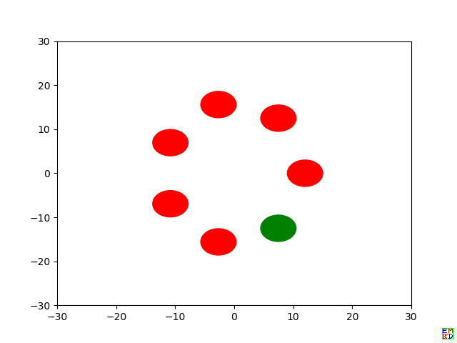
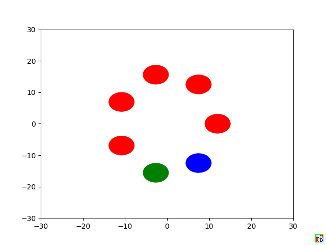
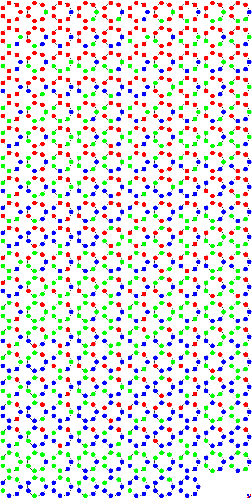
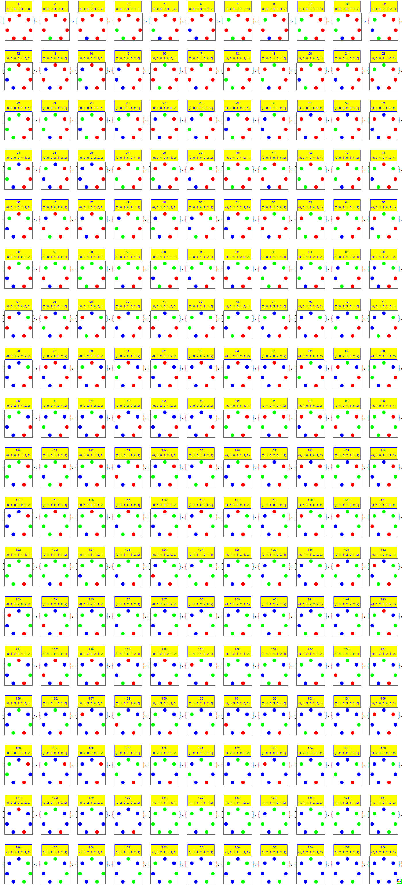
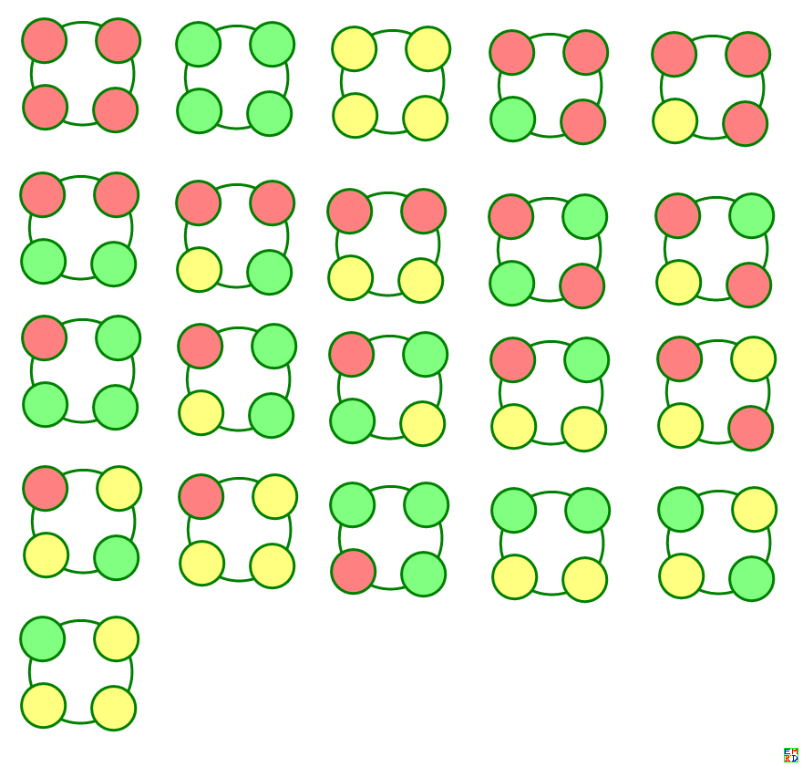
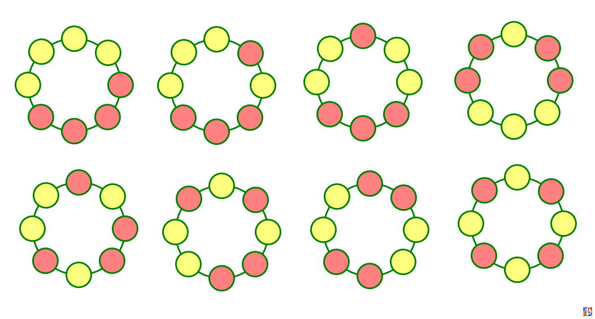

2016年10月[TSC999提问](https://bbs.emath.ac.cn/forum.php?mod=viewthread&tid=9161&fromuid=20)：  
用 m 种颜色的珠子穿手串，每串有 n 颗珠子，每种颜色的珠子都足够多。有多少种配色不同的手串？
<!--more-->
2019年10月[markfang2050提问](https://bbs.emath.ac.cn/forum.php?mod=viewthread&tid=16961&fromuid=20):  
某珠宝商准备将蓝、绿、紫三种不同颜色的珠子串成由七颗珠子组成的手链进行出售。请问有多少种不同排列顺序的手链产生？  
注意：1，没说一定要用全三色；2，手串是环形，对称性要排除。  

# 详细内容
## 七色彩珠
markfang2050给他的问题[配上几个例图](https://bbs.emath.ac.cn/forum.php?mod=redirect&goto=findpost&ptid=16961&pid=81454&fromuid=20):  
  
  
  
  
  

mathe[手工分析markfang2050的问题](https://bbs.emath.ac.cn/forum.php?mod=redirect&goto=findpost&ptid=16961&pid=81450&fromuid=20):  
同色3种, 如果左右对称，对称轴过一棵珠子，$3^4-3=78$种（需要去除同色的三种）, 任意摆放的去掉同色和对称的有$\frac{3^7-3-78\times 7}{14}=117$,
得出总数为$3+78+117=198$.  

northwolves很快回复markfang2050,对于他的问题，[n颗珠子对应的答案为](https://bbs.emath.ac.cn/forum.php?mod=redirect&goto=findpost&ptid=16961&pid=81448&fromuid=20):  
```bash
1 3
2 6
3 10
4 21
5 39
6 92
7 198
8 498
9 1219
```
并且后来右[给出对应](https://bbs.emath.ac.cn/forum.php?mod=redirect&goto=findpost&ptid=16961&pid=81460&fromuid=20)的python代码并且计算到n=30:  
```bash
import numpy as np
def count(n):
    m=0
    for i in range(n):
        m+=3.0**np.gcd(n,i+1)
    m+=(2+n%2)*n*3**(n//2)
    return int(m//(2*n))
for n in range(1,31):
    print (n,count(n)) 
```
并且指出结果和[A027671](https://oeis.org/A027671)匹配。  

markfang2050也同样给出了[Python代码](../attached/colorfulring/markfangring.txt), 并且指出这个问题可以用burnside引理或Polya定理高效解决。

chyanog使用Mathematica代码[计算和做出](https://bbs.emath.ac.cn/forum.php?mod=redirect&goto=findpost&ptid=16961&pid=81481&fromuid=20)所有对应的手链:  
  
dlpg070改进chyanog的代码[将数据结果和图片放在一起](https://bbs.emath.ac.cn/forum.php?mod=redirect&goto=findpost&ptid=16961&pid=81503&fromuid=20):  
  

## 彩色手串
hujunhua[指出](https://bbs.emath.ac.cn/forum.php?mod=redirect&goto=findpost&ptid=16961&pid=81479&fromuid=20)7色手链问题是我们已经讨论过的[彩珠手串的配色计数](https://bbs.emath.ac.cn/thread-9161-1-1.html)的特例。  
其中，TSC999首先自己给出了一个计算结果的表格:  

<table width=50%>
<tr><td colspan=2 rowspan=2> </td><td colspan=12> m种颜色</td></tr>
<tr><td> 1 </td><td> 2 </td><td> 3 </td><td> 4 </td><td> 5 </td><td> 6 </td><td> 7 </td><td> 8 </td><td> 9 </td><td> 10 </td><td> 11 </td><td> 12 </td></tr>
<tr><td rowspan=11>
 n
颗
珠
子</td><td> 2 </td><td>1 </td><td>3 </td><td>6 </td><td>10 </td><td>15 </td><td>21 </td><td>28 </td><td> 36</td><td>45 </td><td>55 </td><td>66 </td><td>78</td></tr>
<tr><td> 3</td><td>1 </td><td> 4</td><td>10 </td><td> 20</td><td>35 </td><td> 56</td><td>84 </td><td> 120</td><td> 165</td><td>220 </td><td>286 </td><td>364 </td></tr>
<tr><td> 4</td><td>1 </td><td>6 </td><td>21 </td><td> 55</td><td>120 </td><td>231 </td><td>406 </td><td>666 </td><td> 1035</td><td> 1540</td><td>2211 </td><td>3081 </td></tr>
<tr><td> 5</td><td>1 </td><td>8 </td><td>39 </td><td>136 </td><td> 377</td><td>888 </td><td>1855 </td><td> 3536</td><td>6273 </td><td>10504 </td><td> 16775</td><td> 25752</td></tr>
<tr><td> 6</td><td> 1</td><td>13 </td><td>92 </td><td>430 </td><td> 1505</td><td>4291 </td><td> 10528</td><td> 23052</td><td> 46185</td><td>86185 </td><td>151756 </td><td>254618</td></tr>
<tr><td> 7</td><td>1 </td><td>18 </td><td>198 </td><td>1300 </td><td> 5895</td><td>20646 </td><td>60028 </td><td> 151848</td><td>344925 </td><td>719290 </td><td> 1399266</td><td>2569788 </td></tr>
<tr><td> 8</td><td>1 </td><td> 30</td><td>498 </td><td>4435 </td><td>25395</td><td>107331 </td><td>365260 </td><td>1058058 </td><td>2707245 </td><td>6278140 </td><td>13442286 </td><td> 26942565</td></tr>
<tr><td> 9</td><td> 1</td><td> 46</td><td> 1219</td><td>15084 </td><td> 110085</td><td>563786 </td><td> 2250311</td><td>7472984 </td><td> 21552969</td><td>55605670 </td><td>131077771 </td><td>286779076 </td></tr>
<tr><td>10</td><td>1 </td><td> 78</td><td> 3210</td><td>53764 </td><td>493131 </td><td> 3037314</td><td>14158228 </td><td>53762472 </td><td>174489813 </td><td>500280022 </td><td> 1297362462</td><td>3096689388 </td></tr>
<tr><td>11</td><td>1 </td><td>126 </td><td>8418 </td><td> 192700</td><td>2227275 </td><td>16514106 </td><td> </td><td> </td><td> </td><td> </td><td> </td><td> </td></tr>
<tr><td>12 </td><td>1 </td><td>224 </td><td>22913 </td><td> 704370</td><td>10196680 </td><td> 90782986</td><td> </td><td> </td><td> </td><td> </td><td> </td><td> </td></tr>
</table>

并且根据上面表格外推出n小于等于6时通项公式：  
$S(m,2)=\frac{m(m+1)}2$  
$S(m,3)=\frac{m(m^2+3m+2)}6=\frac{m(m+1)(m+2)}6$  
$S(m,4)=\frac{m(m^3+2m^2+3m+2)}8=\frac{m(m+1)(m^2+m+2)}8$  
$S(m,5)=\frac{m(m^4+5m^2+4)}{10}=\frac{m(m^2+1)(m^2+4)}{10}$  
$S(m,6)=\frac{m(m^5+3m^3+4m^2+2m+2)}{12}=\frac{m(m+1)(m^4-m^3+4m^2+2)}{12}$  
后来又给出了S(m,7), S(m,8)的公式：  
$S(m,7)=\frac{m(m^6+7m^3+6)}{14}$  
$S(m,8)=\frac{m(m^7+4m^4+5m^3+2m+4)}{16}$  
并且给出了S(3,4)对应的所有情况的图片:  
  
kastin[给出分析](https://bbs.emath.ac.cn/forum.php?mod=redirect&goto=findpost&ptid=9161&pid=63935&fromuid=20):  
下面内容引自 常新德 永城职业学院《有重复元素的圆排列和环排列的计数问题》:  
记 $k\,(k\geqslant 1)$ 重集 $S=\{n_1\*e_1,n_2\*e_2,\cdots,n_k\*e_k\}$，其中 $e_i,\,n_i\;(i=1,2,\dots,k)$分别为元素以及相应的重复数，且集合的势 $|S|=n_1+n_2+\cdots+n_k=n$. 那么该集合所有元素的  
1）圆排列数为$$ Q(S)=\frac{1}{n}\sum_{d|(n_1,\cdots,n_k)}\varphi(d)\frac{(\frac{n}{d})!}{\Pi_{i=1}^k(\frac{n_i}{d})!}$$其中 $\varphi(x)$ 为数论中的欧拉函数，$(n_1,\cdots,n_k)$ 表示 $n_1,n_2,\cdots,n_k$ 的最大公约数。  
2）环排列数为$R(S)=\frac{Q(S)+M(S)}{2}$其中，$M(S)=\frac{\left(\sum_{i=1}^k [\frac{n_i}2]\right)!}{\Pi_{i=1}^k [\frac{n_i}2]!}$ 为对称圆排列数，$[x]$ 为高斯函数（表示 $x$ 的整数部分）。  
注意：环排列和圆排列，概念有细微区别。环排列考虑旋转不变且翻转不变，而圆排列考虑的是旋转不变。  
现在，假定有$c$种$k$重集，那么楼主的手串总数就是$S(m,n)=\sum^m_{k=1}\sum^c_{i=1}C^k_mR(S_i)$问题分三步进行：  
1. 求线性不定方程 $x_1+x_2+\cdots+x_m=n$ 的非负整数解（共 $C_{n+m-1}^{m-1}$ 组解）。  
2. 对任一组解$(n_1,n_2,\cdots,n_m)$, 计算相应的重集 $S_i=\{n_1\*e_1,n_2\*e_2,\cdots,n_m\*e_m\}$的环排列数$R(S_i)$。  
3. 将这些环排列数相加，$S(m,n)=\sum^c_{i=1}R(S_i)$。（这与上面的汇总公式不同，是因为这里第1步中允许$x_i$取0，$c=C_{n+m-1}^{m-1}$）  
TSC999又根据论文内容给出对应的红黄各四穿成八珠手串的漂亮图片：  
  
hujunhua[指出](https://bbs.emath.ac.cn/forum.php?mod=redirect&goto=findpost&ptid=9161&pid=63961&fromuid=20)：  
可以在OEIS中找到
S(2,n)=[A000029](http://oeis.org/A000029)  
S(3,n)=[A027671](http://oeis.org/A027671)  
S(4,n)=[A032275](http://oeis.org/A032275)  
S(5,n)=[A032276](http://oeis.org/A032276)  
S(6,n)=[A056341](http://oeis.org/A056341)  
S(7,n)=[A032276](http://oeis.org/A032276)  
以及  
S(m,9)=[A060561](http://oeis.org/A060561)  
S(m,10)=[A060562](http://oeis.org/A060562)  

kastin[接着用](https://bbs.emath.ac.cn/forum.php?mod=redirect&goto=findpost&ptid=9161&pid=63962&fromuid=20)伯恩赛德引理（Burnside's lemma，波利亚计数定理就是用它推导得来的）就能得到如下结论：
对于 $m$ 个颜色可重复地选取 $n$ 个排成一圈，圆排列数为$N(m,n)=\frac{1}{n}\sum_{i=1}^n m^{(n,i)}$环排列数为
$M(m,n)=\frac{N(m,n)}2+\begin{cases}\frac{m^{k+1}}{2},&n=2k+1 \\ \frac{(m+1)m^k}{4},&n=2k \end{cases}$  

[hujunhua 猜测](https://bbs.emath.ac.cn/forum.php?mod=redirect&goto=findpost&ptid=9161&pid=63963&fromuid=20)对于$n$是一个奇素数$p$的情况，有$S(m,p)=\frac{m(m^{\frac{p-1}2}+p-1)(m^{\frac{p-1}2}+1)}{2p}$ .  
并且得出$S(m,2p)=\frac{m\left(m^{2p-1}+p\cdot m^p+(p+1)m^{p-1}+(p-1)(m+1)\right)}{4p}$.  

