#摘要
mathe于2008年2月[转载了陈计提出的一道不等式](https://bbs.emath.ac.cn/thread-164-1-1.html)  
如果 $a,b\gt 0$,而且$a+b=4$,  
求证 $(a+\frac1a)(b+\frac1b)\ge \frac{25}4$.  
同样，三个数时,如果$a,b,c\gt 0$,而且$a+b+c=6$,  
求证 $(a+\frac1a)(b+\frac1b)(c+\frac1c)\ge \frac{125}8$.  

并且mathe希望将其推广到4个数的情况以及更多数的一般情况。  

这个不等式看上去挺简单的，应该在这些数都相等时取等号。但是实际上这个不等式在俩个数和三个数能够在数字相等时取等号还是挺凑巧的。
最后分析结果表明，将这些数的平均数稍微提高一点，就无法在数字相等时取到等号了。

我们知道琴生不等式可以很好处理关于凹函数或凸函数的不等式，而[icesheep发现](https://bbs.emath.ac.cn/forum.php?mod=redirect&goto=findpost&ptid=164&pid=30058&fromuid=20) 的一个[关于半凹半凸函数的不等式](https://artofproblemsolving.com/community/c6h64933) 可以很好的处理
这里的不等式问题，并且可以处理一大批类似的不等式，比如[下面这个不等式](https://bbs.emath.ac.cn/thread-2553-1-1.html) 也可以用类似方法来出来  
已知 $xyz=1$ 求证 $\frac{1}{(1+x)^2}+\frac{1}{(1+y)^2}+\frac{1}{(1+z)^2}\ge \frac{3}{4}$

#问题初探
troy很快给出了[两个数情况的一种初等证明](https://bbs.emath.ac.cn/forum.php?mod=redirect&goto=findpost&ptid=164&pid=858&fromuid=20) :  
as $a,b\gt 0$ and $a+b=4$  
assume $f=(a+\frac 1a)(b+\frac 1b)=ab+\frac{a^2+b^2+1}{ab}$  
as $a^2+b^2+2ab=(a+b)^2$  
then $f = ab+\frac{(a+b)^2-2ab+1}{ab}=ab+\frac{16-2ab}{ab}+\frac1{ab}=ab+\frac{17}{ab}-2$  
assume $ab=t$ then $f = t+\frac{17}t-2$  
所以$a,b$是$x^2-4x+t=0$的两个根  
所以$\Delta=4^2-4t\ge 0$  
所以$t\le 4$  
即$ab\le 4$  
易证：$y=x+\frac{17}x$在$(0,\sqrt{17})$是递减的,即在$(0,4]$是递减的  
所以当x=4时，$ymin=4+\frac{17}4$  
所以  $f=t+\frac{17}t-2\ge 4+\frac{17}4-2=\frac{25}4$.  

2天后，mathe说他给出的附件里面通过使用数学分析给出了3个数情况的证明，并且得出四个数不再在四个数都相等时取到最小值了，可惜附件已经无法访问了。  

[wayne分析得出](https://bbs.emath.ac.cn/forum.php?mod=redirect&goto=findpost&ptid=164&pid=17729&fromuid=20)  
当$a+b=T\ge 2 \sqrt{2 + \sqrt{5}}=4.116342054542985$时，$(\frac1a + a)(b + \frac1b)$的最小值在
a取方程$ a^4 + a^2 T^2- 2 a^3 T - T^2 -1 = 0$的一根T=$\frac12 (a + \sqrt{a^2 - 4 \sqrt{1 + a^2}}) $时取得，此时最小值为$2\sqrt{T^2 + 1} - 2$; 否则，最小值在$a=\frac T2$处取得。  

mathe试着用pari/gp做出[不超过5个数时的最小值图像](https://bbs.emath.ac.cn/forum.php?mod=redirect&goto=findpost&ptid=164&pid=17791&fromuid=20)  
其中横坐标是n个数的和. 图上三条曲线：最高红色曲线是极小值的对数；绿色曲线是取极值时一个变量的取值(小的那个)；另外一条红色的折线是这个变量的数目.  
两个数:  
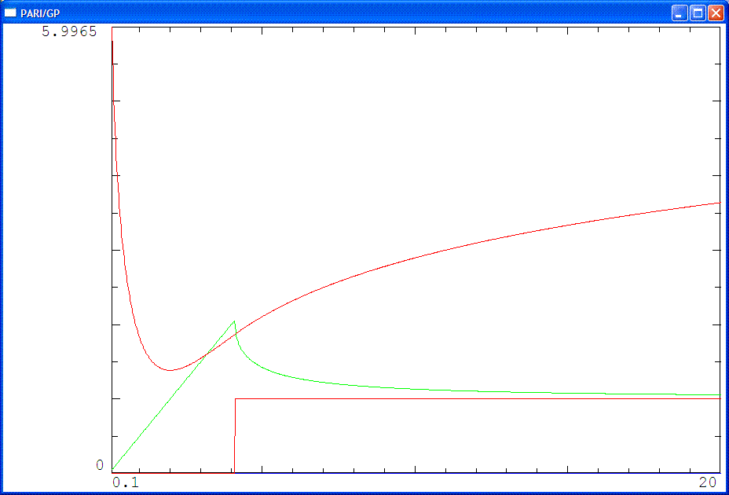  
三个数:  
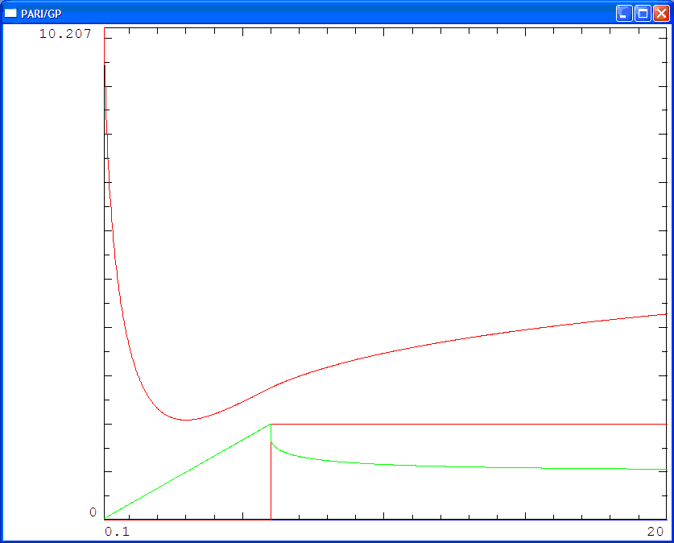  
四个数:  
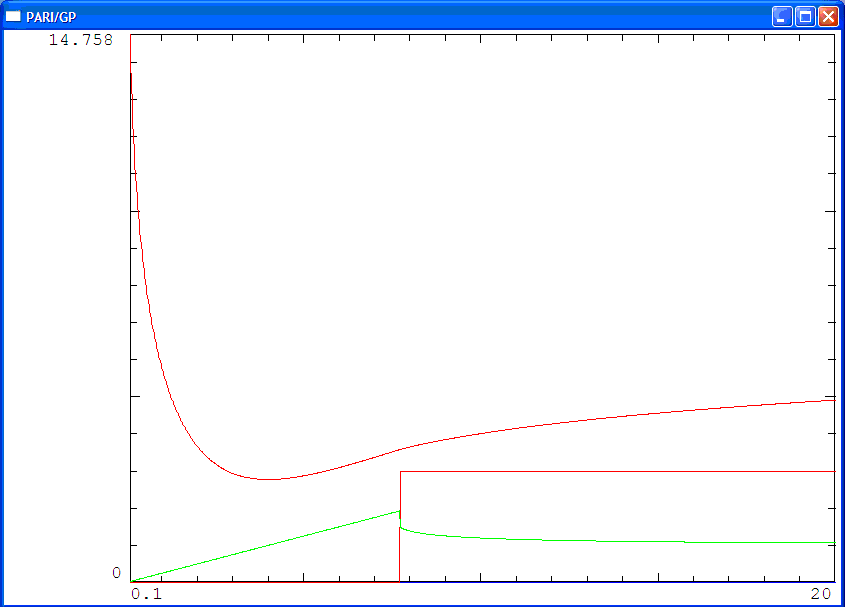  
五个数:  
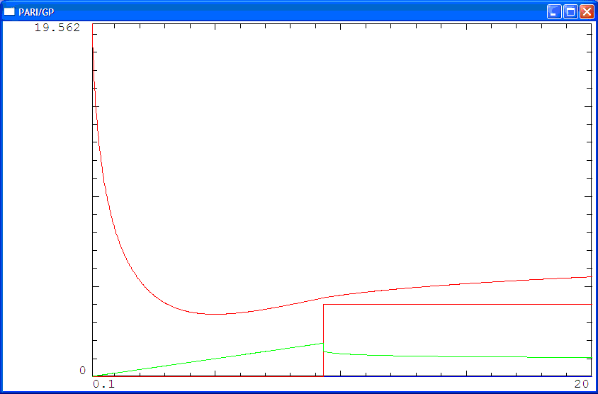  

从上面的图中可以看出,对于n比较大的情况,结论还是挺简单的：也就是n个数全相等或n-1个较小的数全相等时才取到最小值.  
现在我们证明这个结论，而这个结论我们已经知道在n=2时成立.  
假设对于n=k-1时上面结论已经成立,  
对于$n=k\ge 3$,我们根据我的附件里面的分析,可以知道,只有在k个数$x_1,x_2,...,x_k$的值只取最多两种不同的值时才可能达到最小值,也就是  
$x_1=x_2=...=x_k=\frac Tk$或$x_1=x_2=...=x_h,x_{h+1}=...=x_k,x_1^2x_k^2=(x_1+x_k)^2+1$时取到最小值.  
现在假设如果在某个$2\le h\le k-2$时可以取到最小值,那么我们得到  
$x_2,x_3,...,x_h,x_{h+1},...,x_k$是$k-1$个数之和为$T-x_1$时的最小值情况,这个同归纳假设矛盾,所以不成里.  
而对于h=1的情况,我们知道$x_1\lt x_2=...=x_h=...=x_{k-1}$是$k-1$个数和为$T-x_k$时的最小值情况,也同归纳假设矛盾,不成里.  
所以我们知道只可能k个数都相同或较小的k-1个数相等这两种情况.

但是上面证明从$n=2$到$n=3$过程的推理不行,对于$k\ge 4$时的推理是可以,所以我们需要补充证明对于$k=3$的情况:  
我们需要排除$x_1\lt x_2=x_3$的取最小值情况.  
假设如果存在这样的取最小值情况,我们知道  
$(x_1,x_2)$是两个数之和为$T-x_3$时候的取最小值条件.  
$(x_2,x_2)$是两个数之和为$T-x_1$时候取最小值的条件.  
而$T-x_3\lt T-x_1$,也就是n=2的时候,在和为$T-x_3$的时候可以在两个数字不想等的时候取到最小值,但是在和为更大的数$T-x_1$时可以在两个数字相等的时候取到最小值,这个同我们前面已经得出的n=2时候的结论不符合(在和小于$2\sqrt{2+\sqrt{5}}$时候必须两者相等才取到最小值,大于$2\sqrt{2+\sqrt{5}}$时候两者不同取到最小值).
由此得出$n=3$的时候也成立

现在还有余下几个问题:  
i)证明对于每个n只有一个边界条件T(n),和小于T(n)必然所有数相等,和大于T(n)必然要求最小的n-1个数相等,而最后一个数不同  
ii)如何计算T(n).当然假设i)成立时我们可以非常容易得出$T(n)\le \frac{n}{n-1}T(n-1)$  

#凹凸函数不等式
icesheep提议使用[一个控制不等式](http://www.artofproblemsolving.com/Forum/viewtopic.php?t=64933)  
这个结论可以把a+b+c=Const ，求 f(a)+f(b)+f(c) 这类问题变成一元的问题  
本题中由于不存在边界情况，函数先凸后凹，那么马上可以知道，取最小值时，要么所有$x_i$相等，要么凸函数部分n-1个$x_i$相等,而凹函数部分只能一个$x_i$.  
但是对于有边界条件的更加一般的情况，我现在觉得还不能排除另外一种可能取3个值的情况，比如同样先凸后凹的情况取最小值，可以若干个$x_i$在凸函数部分，若干个取最大的边界，还有一个$x_i$取凹函数非最大值的情况（相当于是边界条件情况）。

#进一步分析
我们知道对于这个问题,[hujunhua](https://bbs.emath.ac.cn/forum.php?mod=redirect&goto=findpost&ptid=2488&pid=30157&fromuid=20) 定义了隐函数$x^2y^2=(x+y)^2+1$
如果采用直接求二阶导数的方法证明上面隐函数是凸的，计算挺复杂的。不过可以有比较取巧的方法。证明函数是凸的，我们只需要在函数上面取两个点$(x_1,y_1),(x_2,y_2)$,然后证明它们的中点在函数上方。也就是已知正数$x_1^2y_1^2=(x_1+y_1)^2+1,x_2^2y_2^2=(x_2+y_2)^2+1$,求证  
$\frac{(x_1+x_2)^2(y_1+y_2)^2}{16}\ge\frac{(x_1+x_2+y_1+y_2)^2}4+1$,  
这个我们只要主要到隐函数单调减，可以假设存在正数a,b使得$ax_1+by_1=ax_2+by_2=c$,  
于是对于两个点的中点$(x_0=\frac{x_1+x_2}2,y_0=\frac{y_1+y_2}2)$,必然也有$ax_0+by_0=c$.  
我们只需要证明函数$x^2y^2$在约束条件$ax+by=c$下的最小值只能在边界上取到就可以了.
现在我们记$f(x)=\ln(x+\frac1x),x\gt 0$,那么我们现在的简化后的问题是已知  
$x+(n-1)y=ns$,求$f(x)+(n-1)f(y)$的最小值.  
我们可以改目标函数为$g(y)=f(ns-(n-1)y)+(n-1)f(y)$,  
于是$g^{\prime}(y)=-(n-1)f^{\prime}(x)+(n-1)f^{\prime}(y)$,所以在$f^{\prime}(y)=f^{\prime}(x)$时才有$g^{\prime}(y)=0$  
同样$g^{\prime\prime}(y)=(n-1)^2f^{\prime\prime}(x)+(n-1)f^{\prime\prime}(y)$
其中$f^{\prime}(y)=\frac{y^2-1}{y^3+y},f^{\prime\prime}(y)=\frac{1+4y^2-y^4}{y^2(y^2+1)^2}$

我们查看hujunhua定义的曲线$x^2y^2=(x+y)^2+1$,它等价于$f^{\prime}(x)=f^{\prime}(y)$
把后面的表达式看成y关于x的隐函数，我们可以得到$\frac{dy}{dx}=\frac{f^{\prime\prime}(x)}{f^{\prime\prime}(y)}$
于是[27#](https://bbs.emath.ac.cn/forum.php?mod=redirect&goto=findpost&ptid=2488&pid=30409&fromuid=20) 最后的要求相当于在曲线$x^2y^2=(x+y)^2+1$上取一点，这个点处切线的斜率为$-\frac1{n-1}$,于是这个唯一的极值点对应与我们一直关注的那条切线的切点，也就是说正好在我们讨论的范围的边界上。而对于我们感兴趣的那个区域，整个区域里面不在存在任何极值点，所以如果将目标函数$f(x)+(n-1)f(y)-nf(s)$看成s的隐函数，在我们讨论的范围里面它是单调的，这个正好解释了[24#](https://bbs.emath.ac.cn/forum.php?mod=redirect&goto=findpost&ptid=2488&pid=30384&fromuid=20) 的图像。也就是说，我上面用二分法来计算总是不会出问题的，而我们讨论的s的分界点是唯一存在的。  
由于hujunhua的word文档里面几个图很重要，特意将它解出来，放在这里:  
下面是函数$x^2y^2=(x+y)^2+1$,虚线部分是$x\lt y$,红色实线分别是这个函数的$x\gt y$的情况和在$x\lt s_0=\sqrt{2+\sqrt{5}}$时采用$x=y$曲线  
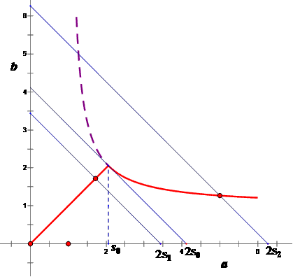  
另外，他还做了n=3时对应约束条件$x+(n-1)y=ns$和这个曲线的相交情况：
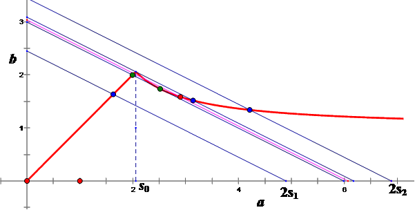  
hujunhua指出:  
问题解决到这一步，回头看陈计的题，a+b+c=6时, 求 $(a+\frac1a)(b+\frac1b)(c+\frac1c)$的最小值最是微妙。微妙之处在于：  
一、n=3时开始需要洞察到变量分离法，用到n=2时的结果；  
二、临界值$s_3=2.00286$，s=2这个整数掐得多近啊，这份拿捏功夫！  
上面$s_3$应该代表3个数时平均值的界限，小于这个值所有的数必须相等才能取最小值，不然，就会出现不相等的情况。
[wayne计算出对于更大n的界限](https://bbs.emath.ac.cn/forum.php?mod=redirect&goto=findpost&ptid=2488&pid=30550&fromuid=20) ：  
  {n, s}  
  {2, 2.0581710272714922503219810475804504212387300996778},   
  {3, 2.0028674080635001794119851594353895098591936385472},   
  {4, 1.9283589164749804283600849366519208504935143395754},   
  {5, 1.8640076500005248507773550047112668361246680901544},   
  {6, 1.8105143812281631669294470754518372814844653568853},   
  {7, 1.7657823500187398298944449193114661418077918949117},   
  {8, 1.7278643120491339236763397022549142889744738389515},   
  {9, 1.6952694244404093388197036920544540897631915879043},   
  {10, 1.6668919831355021439286590328354351752602362836085},   
  {11, 1.6419090461609485136610166407540222037432376500598},   
  {12, 1.6196998599244209974512574541584269465411413557634}  

  

而问题最小值可以转化为求  
$x_1^2x_n^2=(x_1+x_n)^2-1,(n-1)x_1+x_n=S$在$0\lt x_1\lt \frac Sn$时候的解,  
然后对于得到的解,还需要比较这个解同所有数都是$\frac Sn$时对应的解那个能够取到更小的值.  
而上面方程中我们可以消去变量$x_n$,得到$x_1$满足方程:  
$f(X)=X^4-2SX^3+(S^2-n^2+4n-4)X^2+(4-2n)SX-S^2-n^2+2n-1$  
而其中  
$f(0)=-S^2-(n-1)^2\lt 0$  
$\frac{f(\frac Sn)}{(n-1)^2}=(\frac Sn)^4-4(\frac Sn)^2-1$  
$fc(X)=4X^3-6SX^2+2(S^2-n^2+4n-4)X+(4-2n)S$  
$f^{\prime}(0)=(4-2n)S\lt 0$  
$f^{\prime}(\frac Sn)\frac{n^3}{(n-1)(n-2)}=2S^3-4n^2S=2S(S^2-2n^2)$  
$f^{\prime\prime}(X)=12X^2-12SX+2S^2-2n^2+8n-8$  
$f^{\prime\prime}(0)=2(S^2-(n-2)^2)$
$f^{\prime\prime}(\frac Sn)=\frac{(2n^2-12n+12)S^2-2n^4+8n^3-8n^2}{n^2}$  
而其中$f^{\prime\prime}(X)$在区间$(0,\frac S2)$上单调减,  
所以我们知道当$0\lt S\lt n-2$时,总是有$f^{\prime\prime}(X)\lt 0,f^{\prime}(X)$单调减,而$f^{\prime}(0)\lt 0$,所以$f^{\prime}(X)\lt 0$,所以$f(X)$单调减,而$f(0)\lt 0$,所以$f(X)$在区间$(0,\frac Sn)$无解.  
而当$n-2\le S\lt\frac{n(n-2)}{\sqrt{n^2-6n+6}}<\sqrt{2}n$时,$f^{\prime\prime}(X)=0$有唯一解,所以$f^{\prime}(X)$先增后减,而这时$f^{\prime}(0)\lt 0$,而且$f^{\prime}(\frac Sn)\lt 0$,  
  利用计算机算出$f^{\prime\prime}(X)$的解为$\frac{\sqrt{3}\sqrt{S^2+2n^2-8n+8)+3S}}6$,而在这个极值处,$f^{\prime}(X)$的取值总为  
    $-\frac{\sqrt{S^2+2n^2-8n+8}(\sqrt{3}S^2+2\sqrt{3}n^2-8\sqrt{3}n+8\sqrt{3})+(9n^2-18n)S}9\lt 0$  
  所以$f^{\prime}(X)\lt 0$,也就是函数$f(X)$同样无解.  
而当$\frac{n(n-2)}{\sqrt{n^2-6n+6}}\le S\lt\sqrt{2}n$时,这时$f^{\prime\prime}(X)\ge 0$,所以$f^{\prime}(X)$严格增,由于$f^{\prime}(\frac Sn)\lt 0$,所以$f^{\prime}(X)\lt 0$,同样$f(X)$严格减,无解.  
而在$S\ge\sqrt{2}n$的时候,我们知道$f^{\prime\prime}(X)\ge 0$,也就是$f^{\prime}(X)$严格增,而$f^{\prime}(0)\lt 0,f^{\prime}(\frac Sn)\ge 0$,所以$f^{\prime}(X)=0$有唯一解,而函数$f(X)$先减后增,  
所以当$\sqrt{2}n\le S\lt\sqrt{2+\sqrt{5}}n$时,由于$f(0)\lt 0,f(\frac Sn)\lt 0$,所以函数f也没有解.  
也就是我们已经证明了在$S\lt \sqrt{2+\sqrt{5}}n$时,函数$f$无解  
而由于$S\ge \sqrt{2+\sqrt{5}}n$时,$f(X)$先减后增,而$f(0)\lt 0,f(\frac Sn)\ge 0$,所以函数$f$在这个区间有唯一解.  

所以我们可以得到$S\lt\sqrt{2}n$时都无解,也就是必须所有的n个数都相等才取最小值.  
而切换到n-1个数相同的情况的最小S应该在$\sqrt{2}n$和$\sqrt{2+\sqrt{5}}n$之间.  
wayne给出n=3时$f(X)$的根的分布图:  
方程 $f(X)=4*X^4-4*S*X^3+(S^2-1)*X^2+2*S*X-S^2-1$=0的四个根随S 如图变化  
其中，我们关注的是那条蓝色的线：  
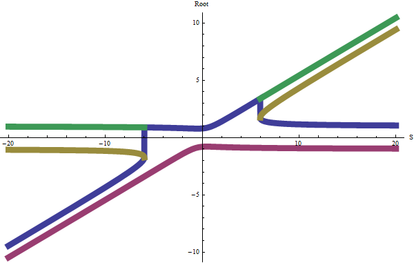  

对于每个n有唯一的$T_n$,和小于$T_n$时必然所有数相等，大于$T_n$时n-1个数相等的分析过程如下:  
而发现我们竟然可以利用n=2的结论证明这个问题。  
我们已经知道存在两个不同数时总有$x_1^2x_n^2=(x_1+x_n)^2+1$,而根据这个图像容易看出$\frac{dx_n}{dx_1}\lt -1$ (其中$x_1\lt x_n$)  
而且我们知道对于n=2,上面方程有解的时候总是取$(x_1,x_n)$比$(\frac T2,\frac T2)$可以有比较好的结果。  
我们现在在图像$f(x)=\ln(x+\frac1x)$上连接$(x_1,f(x_1)),(x_n,f(x_n))$，由于f(x)先凸后凹，$x_1$在凸区间，$x_n$在凹区间，无论用几何意义还是导数证明容易得出，这条线段必然还同图像交于唯一一点$x^{*}$.根据n=2时的结论，我们有$f(x_1)+f(x_n)<2f(\frac{x_1+x_n}2)$,所以根据图像得出$\frac{x_1+x_n}2\gt x^{*}$.  
现在我们把$x^{*t}$看成$x_1$的隐函数，看两者的关系,设$x^{*} =(1-\lambda)x_1+\lambda x_n$,我们看看能否计算$\lambda$关于$x_1$是如何变化的，而上面n=2的结论给出总有$\lambda\lt \frac12$.  
于是$f((1-\lambda)x_1+\lambda x_n)=(1-\lambda)f(x_1)+\lambda f(x_n)$  
两边同时对$x_1$求导得出  
$f^{\prime}(x^{*})((x_n-x_1)\frac{d\lambda}{dx_1}+1-\lambda+\lambda\frac{dx_n}{dx_1})=(f(x_n)-f(x_1))\frac{d\lambda}{dx_1}+(1-\lambda)f^{\prime}(x_1)+\lambda f^{\prime}(x_n)\frac{dx_n}{dx_1}$  
注意到$f^{\prime}(x_1)=f^{\prime}(x_n)$  
我们得出  
$\frac{d\lambda}{dx_1}=\frac{(1-\lambda+\lambda\frac{dx_n}{dx_1})(f^{\prime}(x^{*})-f^{\prime}(x_1))}{f(x_n)-f(x_1)-f^{\prime}(x^{*})(x_n-x_1)}$  
根据几何意义，其中分母显然小于0.而$f^{\prime}(x^{*})-f^{\prime}(x_1)$显然根据图像大于0，所以$\frac{d\lambda}{dx_1}$的符号取决于$(1-\lambda+\lambda\frac{dx_n}{dx_1})$的符号，  
不过还是不能判断出来。如果能够得出$\frac{d\lambda}{dx_1}\lt 0$,那么就可以得出最终的结论了。

添加$\lambda$关于$x_1$的图片  
以及$(1-\lambda+\lambda\frac{dx_n}{dx_1})$的图片  
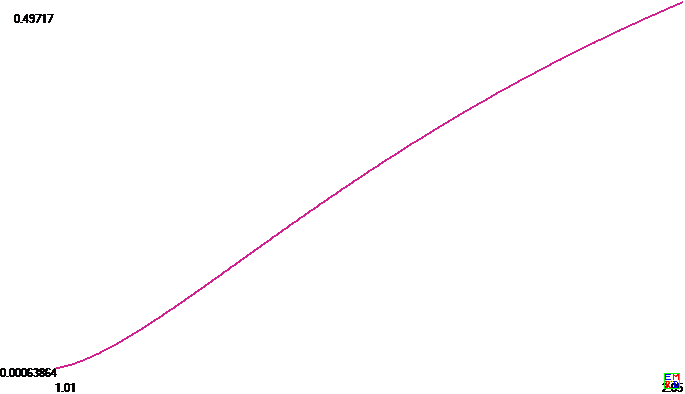  
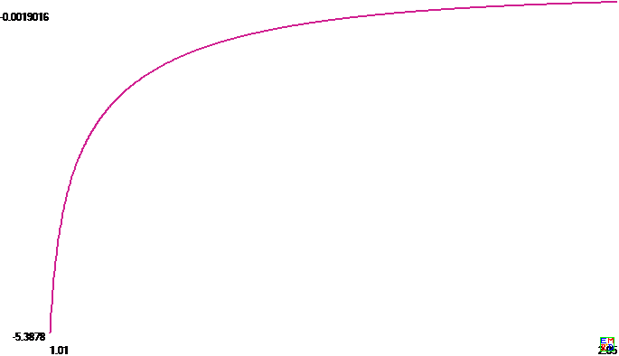  

对于n个数，我们已经知道取最小值必然两种情况之一:  
i) n-1个数取$x_1$,1个数取$x_n$而且$(x_1x_n)^2=(x_1+x_n)^2+1$  
ii)n个数相等  
我们需要比较两种情况最值哪个更小就取哪种情况。  
记$r=\frac 1n$,于是第一种情况取值为$(n-1)f(x_1)+f(x_n)=n((1-r)f(x_1)+rf(x_n)$,第二种取值为$nf((1-r)x_1+rx_n)$.  
于是两者之差为$n((1-r)f(x_1)+rf(x_n)-f((1-r)x_1+rx_n))$,  
对$x_1$求导得到$n((1-r)f^{\prime}(x_1)+rf^{\prime}(x_n)\frac{dx_n}{dx_1}-f^{\prime}((1-r)x_1+rx_n)((1-r)+r\frac{dx_n}{dx_1}))=n(1-r+r\frac{dx_n}{dx_1})(f^{\prime}(x_1)-f^{\prime}((1-r)x_1+rx_n))$.  

记函数$f(x)=\ln(x+\frac{1}{x})$,题目相当于已知正数$x_1,x_2,\dots,x_n$满足$x_1+x_2+\dots+x_n=S$,求$T=f(x_1)+f(x_2)+\dots+f(x_n)$的最小值。  
首先我们有$f^{\prime}(x)=\frac{x^2-1}{x(1+x^2)}$,$f^{\prime\prime}(x)=\frac{1+4x^2-x^4}{x^2(1+x^2)^2}$  
很显然在$x\gt 0$时，$f^{\prime\prime}(x)=0$有唯一解$x=x_0=\sqrt{2+\sqrt{5}}=2.058\dots$  
于是在$x\le x_0$时，$f^{\prime}(x)$单调增,$f(x)$是凸函数；在$x\ge x_0$时,$f^{\prime}(x)$单调减,$f(x)$是凹函数.  
$f^{\prime}(x)$的图片:  
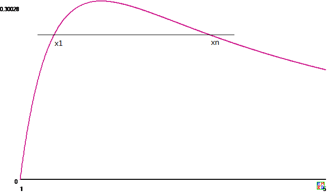  

首先显然，边界条件对应某个$x_i\to 0$，而这时目标函数T趋向正无穷，不可能取到最小值，所以最小值只能在内部极值点取到。  
使用拉格朗日乘数法，可以得到极值对应条件为  
$f^{\prime}(x_1)=f^{\prime}(x_2)=\dots=f^{\prime}(x_n)$  
由于$f^{\prime}(x)$先增后减，于是$x_1,x_2,\dots,x_n$中最多有两个不同的取值.  
不妨设$x_1\ne x_n$,于是$f^{\prime}(x_1)=f^{\prime}(x_n)$,得到$x_1^2x_n^2=(x_1+x_n)^2+1$,其中$1\lt x_1\lt x_0\lt x_n$，而由于$x_n$处f(x)凹，如果$x_n$使用两次以上，必然不是T取最小值情况(对于充分小的t,用$x_n-t,x_n+t$替换两个$x_n$可以让T得到更小的值)。所以这种情况只能n-1个$x_1$,一个$x_n$.  
$x_n$的表达式也可以另外写成$x_n=\frac{x_1+\sqrt{x_1^4+x_1^2-1}}{x_1^2-1}$,  
$x_n$关于$x_1$的图片
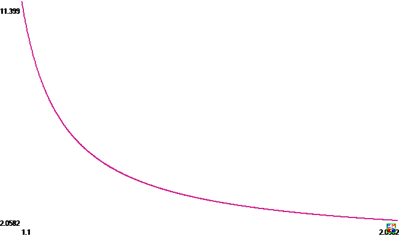  
另外我们需要将这种极值情况同n个数全部相等的极值情况向比较，可以得出两个极值的差值为  
$\Delta_n(x_1)=n((1-r)f(x_1)+rf(x_n)-f((1-r)x_1+rx_n))$,其中$r=\frac{1}{n}$.  
其关于$x_1$的导数为  
$\Delta^{\prime}_n(x_1) = n((1-r)f^{\prime}(x_1)+rf^{\prime}(x_n)\frac{dx_n}{dx_1}-f^{\prime}((1-r)x_1+rx_n)((1-r)+r\frac{dx_n}{dx_1}))=n(1-r+r\frac{dx_n}{dx_1})(f^{\prime}(x_1)-f^{\prime}((1-r)x_1+rx_n))$.  
其中我们需要注意的是根据$f^{\prime}(x)$的图像容易看出$f^{\prime}((1-r)x_1+rx_n)\gt f^{\prime}(x_1)=f^{\prime}(x_n)$.  
另外由于$\frac{dx_n}{dx_1}=-\frac{x_1x_n^2-x_1-x_n}{x_1^2x_n-x_1-x_n}=-\frac{x_n}{x_1}\frac{x_1^2x_n^2-x_1^2-x_1x_n}{x_1^2x_n^2-x_1x_n-x_n^2}=-\frac{x_n}{x_1}\frac{x_n^2+x_1x_n+1}{x_1^2+x_1x_n+1}$.  
所以容易看出$\frac{dx_n}{dx_1}\lt 0$,$x_n$关于$x_1$单调减，又因为$x_n\ge x_1$，得出$\frac{dx_n}{dx_1}$也关于$x_1$单调增（绝对值减少）.  
$\frac{dx_n}{dx_1}$关于$x_1$的图片
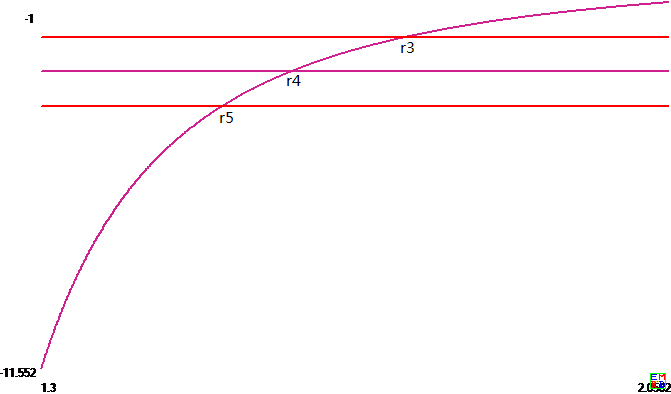  
而且显然在$x_1\to 1$时$\frac{dx_n}{dx_1}\to -\infty$,而$x_1\to x_0$时$\frac{dx_n}{dx_1}\to -1$,  
于是存在唯一$r_n$使得$x_1=r_n$时$\frac{dx_n}{dx_1}=-(n-1)$($n\ge 3$)时, 
$\Delta_4(x)$的图  
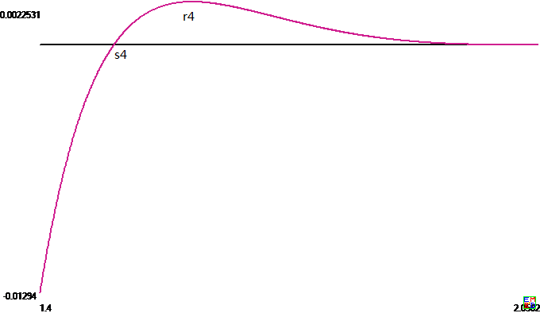  
而$\Delta_n(x_1)$在$x_1\lt r_n$时单调增，在$r_n\lt x_1\le x_0$时减,而且$\Delta_n(x_0)=0,\Delta_n(1)=-\infty$,所以有唯一$s_n$，其中$1\lt s_n\lt r_n$使得$\Delta_n(s_n)=0$.  
而在$x_1\lt s_n$时，$\Delta_n(x_1)\lt 0$；$x_1\gt s_n$时，$\Delta_n(x_n)\gt 0$,
而对于每个给定$x_1$有对应$S=(n-1)x_1+x_n$,其对于$x_1$的导数为$\frac{dS}{dx_1}=(n-1)+\frac{dx_n}{dx_1}$,所以在$x_1\lt s_n\lt r_n$时，$\frac{dS}{dx_1}\lt 0$,  
在n=4时S关于$x_1$的图  
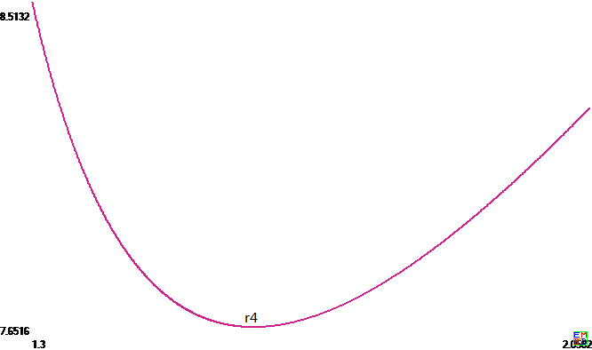  
也就是如果$x_1=s_n$对应的$S=S_n$,那么$x_1\lt s_n$对应于$S\gt S_n$。也即是和S大于一个常数$S_n$时需要两个不同取值的$x_i$时T取到最小值;而在$S\le S_n$时,所有变量取值相等T才取到最小值.  
另外，我们可以看出，对于部分S,可以有两个$x_1$相对应，其中一个小于$r_n$，一个大于$r_n$,而只有小于$s_n$的$x_1$才能对应T取最小值情况（而如果两个都大于$s_n$那么只有全部相等情况才行）。  
数值计算结果  
$r_3=1.740411449278029845734308926,s_3=1.657192792516150065878529915,S_3=6.008602224190500538235955480$  
$r_4=1.600485180440240838317819642,s_4=1.497336479006372785981767326,S_4=7.713435665899921713440339745$  
$r_5=1.517582550159295840149998641,s_5=1.408470004464252711744740637,S_5=9.320038250002624253886775023$  
$r_6=1.461303403894868433140713446,s_6=1.350919585834549644761334220,S_6=10.86308628736897900157668245$  
$r_100=1.100918455622057296344282356,s_100=1.051229206129076187764123092,S_100=125.0349255508031551479807498$  
容易估算$r_n \approx1+\frac1{\sqrt{n-1}}$, 而$s_n\lt r_n$得出$S_n$基本大于$n-1+2\sqrt{n-1}$  
