2008年7月liangbch提出[一个铺地砖问题](https://bbs.emath.ac.cn/thread-635-1-1.html):  
我们想要用正多边形的砖来铺地板,且须满足以下条件。  
   1.必须是采用正多边形的砖来铺，可以用一种正多边形，也可以采用几种正多边形。  
    采用一种正多边形的铺法（排列）方法三种，分别是 三角形，正方形，六边形。重点需要分析一下，采用多种多边形有几种排列方法。  
   2.每个顶点（多变形各个顶点的交叉点）上的多边形的排列必须相同。  
   3.采用相同的排列方式，地砖可无限扩展。反例，附件5-5-10 采用每个顶点包含 2个5边形和1个10边形，但是接着铺下去就不能满足条件了。  
<!--more-->

采用正三角形的铺法:  
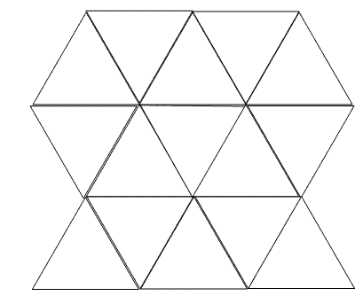  
采用正四边形的铺法:  
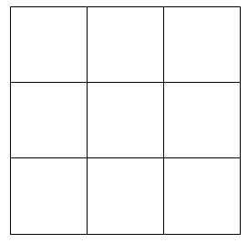  
采用正六边形的铺法:  
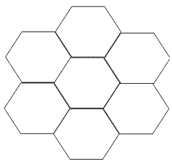  
采用正八边形和正方形的铺法:  
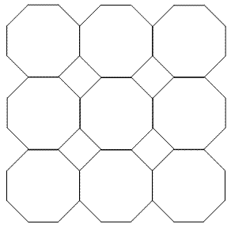  
采用正五边形和正十形的铺法（错误的铺法）:  
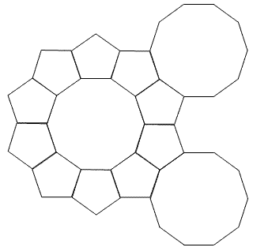  

# 更多讨论
[liangbch提出](https://bbs.emath.ac.cn/forum.php?mod=redirect&goto=findpost&ptid=635&pid=7742&fromuid=20)：  
满足铺地板的一个必要条件是每个顶点的各个多边形的内角和是360°。下面列出法符合这个条件的一些铺法：  
```bash
每个顶点3块砖
　　1、6+6+6
　　2、8+8+4(每个顶点包含2个八边形一个四边形,下同）
　　3、10+10+5
每个顶点4块砖
　　4、4+4+4+4
　　5、3+4+4+6
每个顶点5块砖
　　6、3+3+3+3+6
每个顶点6块砖
　　7、3+3+3+3+3+3
```
大家可验证这几种排法，哪个能满足条件，哪个不能满足条件，是否还有其他排列方法。  
[gxqcn指出](https://bbs.emath.ac.cn/forum.php?mod=redirect&goto=findpost&ptid=635&pid=7745&fromuid=20)，再增加两个：  
```bash
　　8、4+6+12
　　9、3+12+12
```
他[补充说明](https://bbs.emath.ac.cn/forum.php?mod=redirect&goto=findpost&ptid=635&pid=7747&fromuid=20):  
正$n$边形的一个内角对圆周角的“贡献”值为：$a_n = \frac{n-2}{2n}$  
我们只要解如下不定方程即可：$\sum a_n xx x_n = 1 \quad ( x_n in bar {ZZ^-} )$  
其中$x_n$表示正$n$边形的选取数（可为零）。  
也许这仅是满足要求的必要条件之一.  
liangbch为gxqcn的方案配了对应的图
4+6+12:  
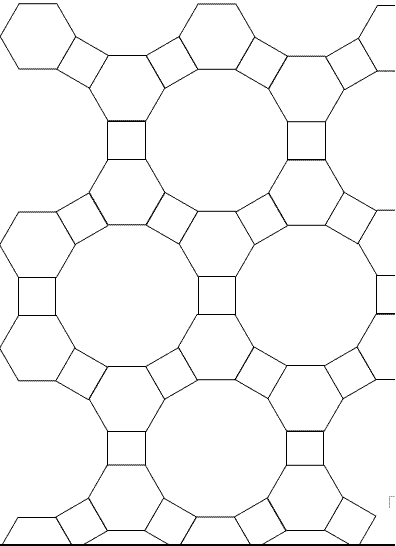  
3+12+12:  
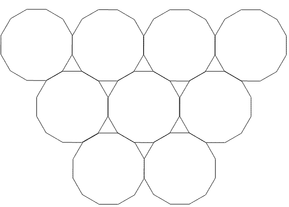  
然后他编程[找出更多的候选方案](https://bbs.emath.ac.cn/forum.php?mod=redirect&goto=findpost&ptid=635&pid=7758&fromuid=20):  
通过编程计算，多个多边形拼起来，其内角和等于360°的组合有：  
```bash
三个角共点的有：
3+7+42
3+8+24
3+9+18
3+10+15
3+12+12
4+5+20
4+6+12
4+8+8
5+5+10
6+6+6

四个角共点的有：
3+3+4+12
3+3+6+6
3+4+4+6
4+4+4+4

五个角共点的有：
3+3+3+3+6
3+3+3+4+4
```
通过简单的画图法，可以排除一些组合，下面对三角共点的一些组合分析一下。  
1、 如果同一个顶点的三个多边形中，有1个是奇数边，则另外两个多边形必须是 相同的偶数多边形。  
```bash
　　符合条件的是：3+12+12
　　不符合条件被排除在外的是：
　　　　3+7+42
　　　　3+8+24
　　　　3+9+18
　　　　3+10+15
　　　　4+5+20
　　　　5+5+10
```
2、同一个顶点的三个多边形中全部是偶数边，且内角和为360°，则可以铺地板，如  
```bash
　　　　4+6+12
　　　　4+8+8
　　　　6+6+6
```
对于4个（5个）多边形共点的情况，同一个组合可以有多种排列。  
如：（3，3，4，12），（3，4，3，12），（3，4，12，3）。  
并且给出了更多的图案:  
3-3-3-3-6：  
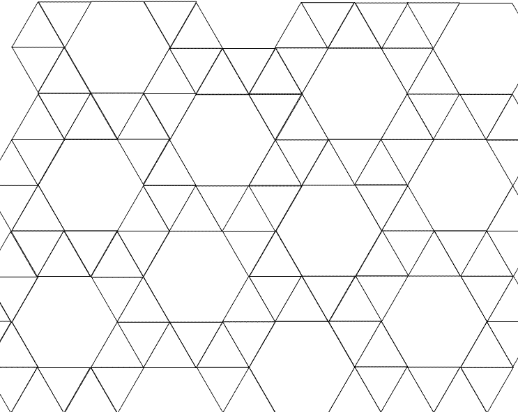  
3-4-6-4:
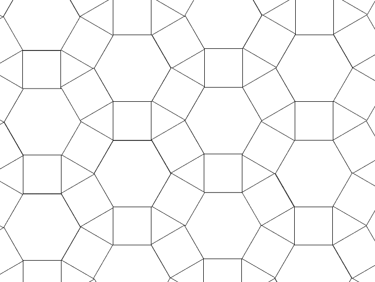  
3-6-3-6:  
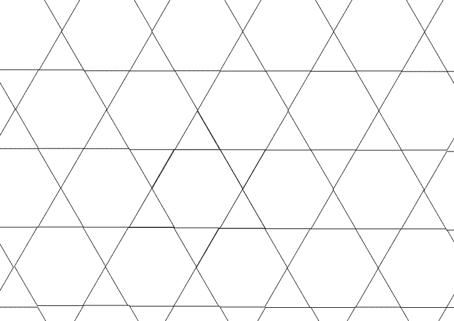  
3-3-6-6试图按（3，3，6，6）的顺序铺地板，结果导致了一些顶点（红圈标出）不再是(3,6,3,6)的顺序，是一种不符合条件的排法:  
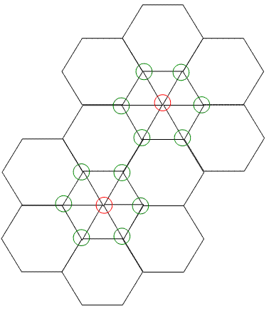  
三个角共点的有：  
3+12+12  
4+6+12  
4+8+8  
6+6+6  

四个角共点的有：  
3+6+3+6  
3+4+6+4  
4+4+4+4  

五个角共点的有：  
3+3+3+3+6  
3+3+3+4+4  

六个角共点的有：  
3+3+3+3+3+6  
   到此时，所以可按照规则铺地板的图形均以画出，共计10种，不知还能不能找到新的方案？

shshsh_0510认为非周期的会更加漂亮，[给出了44333型非周期方案](https://bbs.emath.ac.cn/forum.php?mod=redirect&goto=findpost&ptid=635&pid=7760&fromuid=20):  
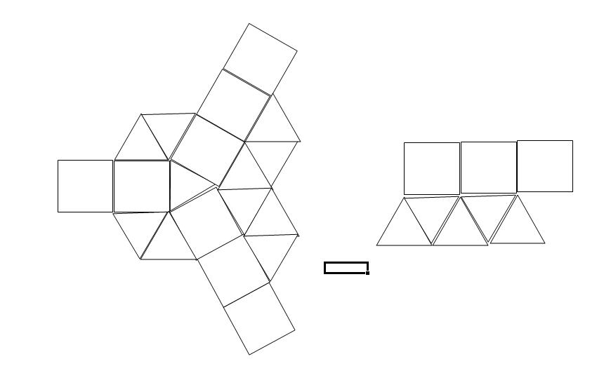  
  

