# 摘要
[2013年1月hujunhua提问](https://bbs.emath.ac.cn/thread-4840-1-1.html) :  
### $Z_6^2$上的最优幻方

在编排6阶全对称幻方时，排成蜂窝状网格（又称为等距网格）比排成方格可体现更高的对称性，如图1所示。图中坐标相同的格为同一格，表现了所谓全对称幻方是嵌入到一个三维环面（轮胎面）的。在平面上表现时，可以按这个局部呈现的相邻关系扩展到整个平面上。扩展后，将视野取为一个如图2那样的正六角形区域时，呈现了6阶幻方的旋转对称性。在等距格网上，原来方格网上的一条对角线（x=y）看起来成为一条主轴。等距网格的对角线定义为相距次近的两格的连线，如图1中的黄色格列（在图2的正六角形视野中，呈现为正六角形的长对角线方向）。按此定义，6阶幻方有3条主轴方向和3条对角线方向，我们要求在其中的每一个方向上直线排列的6格数之和都等于幻方和数。这就比通常所谓的“全对称幻方”约束更多，对称性更高。

| 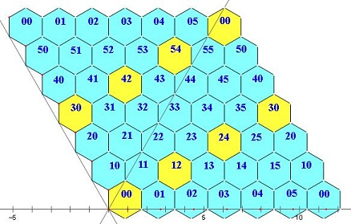 | 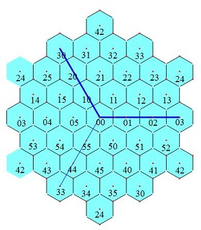 |
|--------------------------------------------|------------------------------------------|   
| 图1   菱形视野                             |                图2 六角形视野            |

用代数学的语言来描述，6阶幻方就是$Z_6^2$→｛1, 2, 3, ..., 36｝的一个映射f, f 满足某些函数方程，即幻方编排者所称的幻方律。比如关于行的幻方律即  
               $ f(x,y)+f(x,y+1)+f(x,y+2)+...+f(x,y+5)=6A$($A$是36个填入数的平均值）  
由于 f 的定义域为模$Z_6^2$, 所以这类幻方宜可称之为模上的幻方，简称模幻方。

除了定义时给出的2条幻方律（其实是6条，但是可用主轴线和对角线分别概括），6阶模幻方还有一些导出的幻方律，展现了其6阶旋转对称性。

导出律1：对角线上的相间三格之和等于3A。如图3所示。变换视野，一条对角线的相间3格布成一个正三角形。图4显示两条这样的半对角线布成了一个正六角形，六角之和等于6A（导出律2）。
导出律3：见图5，4个黄色格（其中格33带红色纹线）之和等于4A。格33也可以在带纹线的青色格的位置，在此视野中这四格呈菱形。

| 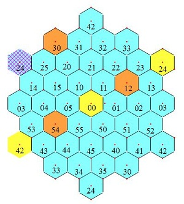 | 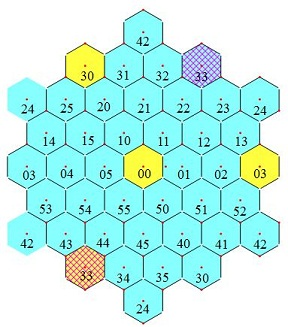 |  |
|----------------------------------------------|----------------------------------------------|----------------------------------------------|  
|图3    导出律1：对角线上的相间三格之和等于3A  | 图4  导出律2：正六角形的六角之和等于6A       |  图5 导出律3：边长为4格的菱形四角之和等于4A  |

还有更多的表现6阶旋转对称性的导出律，下帖给出。这些导出律并非观察具体的数字而来，而是依据定义所给的约束方程消元而得。要用具体的数字来验证这些幻方律，我暂时还没有实例，因为我至今也没有编排出一个6阶模幻方的实例。事实上，对于这样的6阶幻方，用｛1, 2, 3, ..., 36｝是填不成功的。因为，图5中的4格减去图3中3格=4A-3A=A，所以A必须是整数。若用｛1, 2, 3, ..., 36｝，总和Σ=18×37，A=Σ/36 非整数。  
为了编出6阶模幻方，f 只能取其它的值域。为了保持幻方的数字之美，值域应该满足一定的要求。我们的要求是尽可能接近自然数前段{1~36}。由于18×37≡18(mod 36), 所以要使A为整数，最接近｛1~36｝的数组是从中去掉18，添上0，即｛0~17，19~36｝。

这就是本擂的目标：用｛0~17，19~36｝填入构建6阶模幻方。

# 更多规律分析

hujunhua接着给出了[更多的规律分析](https://bbs.emath.ac.cn/forum.php?mod=redirect&goto=findpost&ptid=4840&pid=47233&fromuid=20) :  
导出律4：如图6所示的边平行于主轴的最小正六角形（黄色格），六角之和加上中心格的2倍等于8A
导出律5：如图7所示的边平行于对角线的最小正六角形（黄色格），六角之和减去中心格等于5A

|  |  |
|----------------------------------------------|--------------------------------------------|   
| 图6     导出律4                               |                图7  导出律5               |

导出律6：图8所示正六角形区域的13个黄格之和等于13A. 由图6与图7叠加即得。
导出律7：图9所示正六边形区域的19个黄格之和等于19A. 由图8与图4叠加即得。
[attachimg]4355[/attachimg][attachimg]4356[/attachimg]
                         图8   导出律6                                                    图9  导出律7

|  | 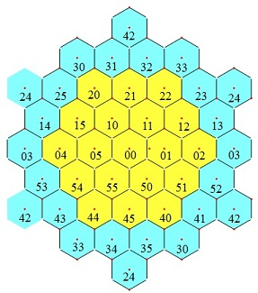 |
|----------------------------------------------|--------------------------------------------|   
| 图8   导出律6                                |                图9  导出律7              |

# 参数方案
接着hujunhua给出了[参数方案分析](https://bbs.emath.ac.cn/forum.php?mod=redirect&goto=findpost&ptid=4840&pid=47246&fromuid=20) :  
导出律1和导出律3涉及的格子少，导出律4涉及的格子密集，这很有利于手工得出参数解。图10就是一个在36个填入数之和为零（称为零和幻方）的条件下的参数布置方案。如果我们用填入数｛±1, ±2, ±3, ..., ±18｝,就会产生零和幻方。
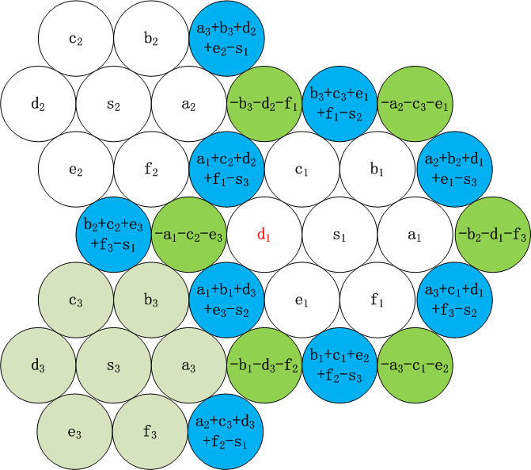  
                        图10   参数解

6阶零和模幻方的定义中给出的36个约束方程的秩为24，所以参数解的维数为12. 上图中我们选两个白六角形的六个角a1,b1,...,f1, a2,b2, ..., f2为参数，其它格就可以由上述导出律得到。s1=-(a1+b1+...+f1)/2, s2=-(a2+b2+...+f2)/2, s3=-(s1+s2), a3=-(a1+a2),....

mathe后来也给出了[类似的分析结果](https://bbs.emath.ac.cn/forum.php?mod=redirect&goto=findpost&ptid=4840&pid=82292&fromuid=20) 

# 单孔6阶模幻方不存在
hujunhua[先开始用程序进行搜索](https://bbs.emath.ac.cn/forum.php?mod=redirect&goto=findpost&ptid=4840&pid=60553&fromuid=20) ，发现52小时才运行了大概5%的进度，没有找到任何合法的结果，终止了代码的运行。  
mathe开始用C编写代码穷举，但是代码里面出现多次bug, 屡败屡战，终于穷举证明了[只有一个空缺的6阶模幻方是不存在的](https://bbs.emath.ac.cn/forum.php?mod=redirect&goto=findpost&ptid=4840&pid=82495&fromuid=20) 。

# 最小6阶模幻方
后来mathe的代码找到了[3孔6阶模幻方](https://bbs.emath.ac.cn/forum.php?mod=redirect&goto=findpost&ptid=4840&pid=82489&fromuid=20) :  
0~39:
Find:  

| 第一列     | 第二列      | 第三列      | 第四列     |  第五列      | 第六列     |
|------------|------------|------------|------------|-------------|------------|  
|a_(0,0)=28  |  a_(0,1)=7 | a_(0,2)=38 | a_(0,3)=8  | a_(0,4)=29  | a_(0,5)=10 | 
|a_(1,0)=17  |  a_(1,1)=25| a_(1,2)=13 | a_(1,3)=22 | a_(1,4)=19  | a_(1,5)=24 |  
|a_(2,0)=21  |  a_(2,1)=18| a_(2,2)=27 | a_(2,3)=15 | a_(2,4)=23  | a_(2,5)=16 | 
|a_(3,0)=11  |  a_(3,1)=32| a_(3,2)=2  | a_(3,3)=33 | a_(3,4)=12  | a_(3,5)=30 |
|a_(4,0)=4   |  a_(4,1)=35| a_(4,2)=9  | a_(4,3)=37 | a_(4,4)=1   | a_(4,5)=34 | 
|a_(5,0)=39  |  a_(5,1)=3 | a_(5,2)=31 | a_(5,3)=5  | a_(5,4)=36  | a_(5,5)=6  |

Find:  

| 第一列     | 第二列      | 第三列      | 第四列     |  第五列      | 第六列     |
|------------|------------|------------|------------|-------------|------------|  
|a_(0,0)=4   | a_(0,1)=3  | a_(0,2)=38 | a_(0,3)=22 | a_(0,4)=23  | a_(0,5)=30 | 
|a_(1,0)=11  | a_(1,1)=35 | a_(1,2)=31 | a_(1,3)=8  | a_(1,4)=19  | a_(1,5)=16 | 
|a_(2,0)=21  | a_(2,1)=32 | a_(2,2)=9  | a_(2,3)=5  | a_(2,4)=29  | a_(2,5)=24 |  
|a_(3,0)=17  | a_(3,1)=18 | a_(3,2)=2  | a_(3,3)=37 | a_(3,4)=36  | a_(3,5)=10 | 
|a_(4,0)=28  | a_(4,1)=25 | a_(4,2)=27 | a_(4,3)=33 | a_(4,4)=1   | a_(4,5)=6  |
|a_(5,0)=39  | a_(5,1)=7  | a_(5,2)=13 | a_(5,3)=15 | a_(5,4)=12  | a_(5,5)=34 |
		
hujunhua将它们转化为图案后发现它们其实是等价的
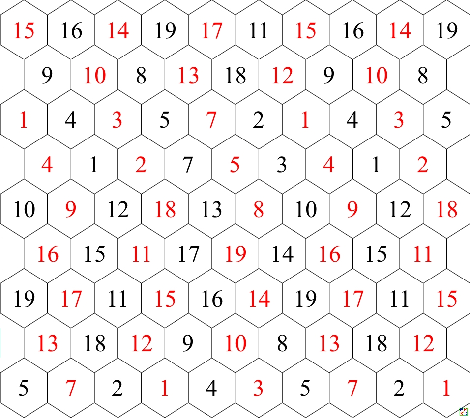  

mathe还[验证](https://bbs.emath.ac.cn/forum.php?mod=redirect&goto=findpost&ptid=4840&pid=82533&fromuid=20) 了也不存在双孔6阶模幻方，并且穷举出[所有可能的三孔6阶模幻方](../attached/c36.tgz) 。

# 美图秀
hujunhua首先对数据进行了分析处理，[得出](https://bbs.emath.ac.cn/forum.php?mod=redirect&goto=findpost&ptid=4840&pid=82542&fromuid=20) :  
把数据平移为-19~+19后，发现大部分都是正负对称的，即都缺 0，剩下的两洞对称。
我还没有发现缺奇数的，目前只发现缺±2、±4、±6、±8、±10、±12、±14、±16的。
相反数对的分布有中心对称、旋转对称、镜像对称、分块对称和不对称的。
不对称的只有少数.

数据预处理完成（转化为M10规则表）， 去重前的分类统计结果：  
{0~38}的48个，化为{-19~19}后全都为非对称数组（即都不含0洞）。  
{洞组, 频数｝如下：
{{-18, -12, -6}, 24}，  
{{-16, -14, -6}, 12}  
{{-14, -12, -10},12}。  
可见皆为非零和幻方，总和为36。化为零和幻方，每格-1，成为{-20~18}，倒是全部为奇数洞了。

{1~39}的6792个，化为{-19~19}后，全部为零和幻方，其中6624个为对称数组，其余168个为非对称数组（含0）。  
{洞组, 频数｝  
{{-2, 0, 2}, 180},   
{{-4, 0, 4}, 240},  
{{-6, 0, 6}, 972},   
{{-8, 0, 8}, 540},  
{{-10, 0, 10}, 768},  
{{-12, 0, 12}, 888},  
{{-14, 0, 14},312},  
{{-16, 0, 16}, 780},  
{{-18, 0, 18}, 1944},(*这个洞组的最多，先前104例中居然没碰到*)。  
{{-10, -8, 18}, 36},（*非对称洞组*）  
{{-18, 8, 10}, 36},(*与上行对称，重合情况有待分析*）  
{{-10, -6, 16}, 12},  
{{-16, 6, 10}, 12}, (*与上行对称，重合情况有待分析*）  
{{-14, -4, 18},36},  
{{-18, 4, 14}, 36}}(*与上行对称，重合情况有待分析*）  

按洞组分离后，就有利于去重了。（免于在不同洞组间进行比较）  

手工处理了48个{0~38}的去重，结果只有4个本原解。每个本原解重复12次（含自身）。  
把数组化成了{-20~18}, 使总和为0，相应的{洞组, 本原解数}如下：  
{{-19, -13, -7}, 2}  
{{-17, -15, -7}, 1}  
{{-15, -13, -11}, 1}  
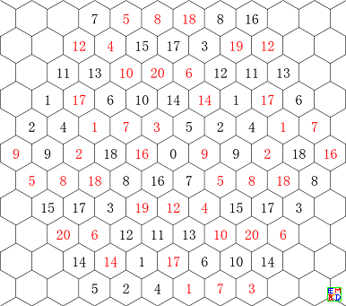  
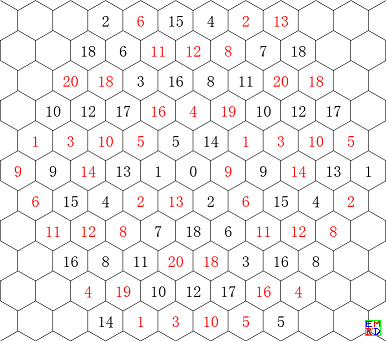  
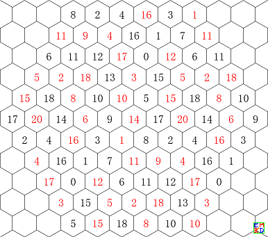  
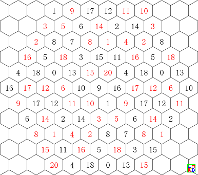  

然后他设计了一个画图的[mathematica代码](https://bbs.emath.ac.cn/forum.php?mod=redirect&goto=findpost&ptid=4840&pid=82811&fromuid=20) 
```bash
RulesArray =Solve[x + y + z == 15 && 0 <= x <= 10 && 0 <= y <= 10 && 0 <= z <= 10, {x, y, z}, Integers];
mf[n_] := m13906[[n, Mod[5 - z, 6, 1], Mod[y + 1, 6, 1]]]
Graphics3D[{Sphere[{x, y, z}], Text[Style[Abs@mf[100], Medium, Bold, If[mf[100] > 0, Black, Red]], {x, y, z}]} /. RulesArray, ViewPoint -> {100, 100, 100}, Boxed -> False]
```
可以给出[类似如下的图](https://bbs.emath.ac.cn/forum.php?mod=redirect&goto=findpost&ptid=4840&pid=82824&fromuid=20) ：
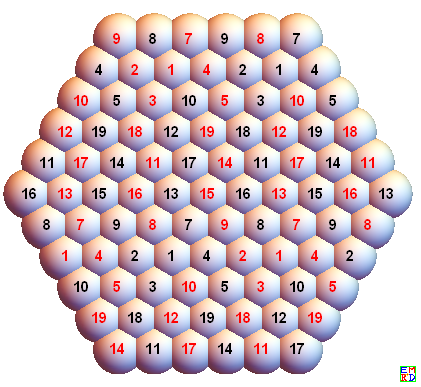  
程序中的坐标{5-z,y+1}的选择是为了使画出来的图的左上角幻方与 mathe 的解的排列顺序一致。
坐标使用±{-x, y}, ±{-y, x}, ±{-y, z}, ±{-z, y}, ±{-z, x}或±{-x, z}都是可以的，无非是旋转和镜像的关系。
或者在此基础上再加一个常数也行（比如我们用的+5和+1），这是平移。
画法原理：就是在平面 x+y+z=15 的下图所示整点上画单位球，利用球的相贯线自动形成蜂巢状。
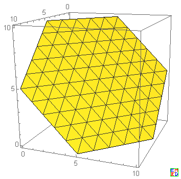  

于是他继续分析余下数据，并给出如下图解:  
{{-10, -8, 18}, 36}  
{{-18, 8, 10}, 36}  
两组正负对应重复，共有3个本原解，每解重复24次。旋转6X转置2X正负2.  
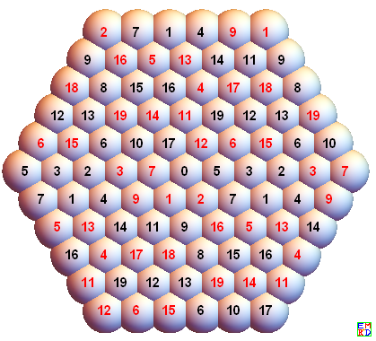  
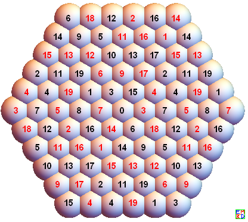  
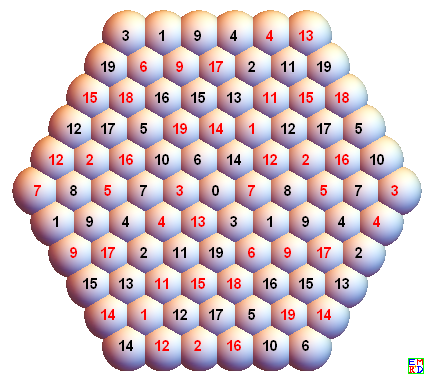  

{{-10, -6, 16}, 12},  
{{-16, 6, 10}, 12}  
两组正负对应重复，共有1个本原解，重复24次。  
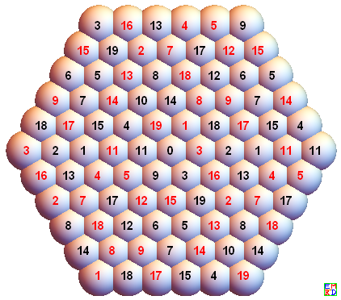  

{{-14, -4, 18},36},  
{{-18, 4, 14}, 36}}  
两组正负对应重复，共有3个本原解，每解重复24次。  
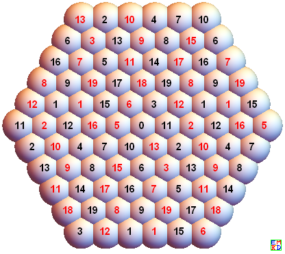  
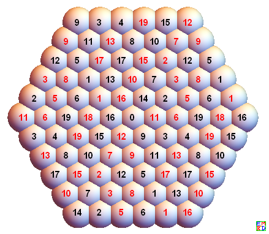  
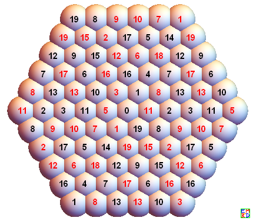  

最后剩下6624个{1~39}对称洞组的  
{洞组, 频数｝  
{{-2, 0, 2}, 180},   
 {{-4, 0, 4}, 240},  
 {{-6, 0, 6}, 972},   
 {{-8, 0, 8}, 540},  
 {{-10, 0, 10}, 768},  
 {{-12, 0, 12}, 888},  
 {{-14, 0, 14}, 312},  
 {{-16, 0, 16}, 780},  
 {{-18, 0, 18}, 1944}  

注意到其中有些频数不是24的倍数，所以不可能都是每解24重。  
失重的应该是正负对称，那些中心对称、镜像对称和平移对称的可能会正负失重，因为它们是自对称的。  

所有频数都是12的倍数，由于不存在旋转和转置自对称者，故可预料每解至少12重。  

### {{-2, 0, 2}, 180}去重:  
mathe是固定 a(3, 2)=2，化为对称数组后即红18不动。下面画图时，a(3, 2)位于中心。

去掉旋转和镜像重复后得[15个解](https://bbs.emath.ac.cn/forum.php?mod=redirect&goto=findpost&ptid=4840&pid=82844&fromuid=20) ，它们的相反数对全都是平移对称的，因此没有取反重复，故此即本原解。

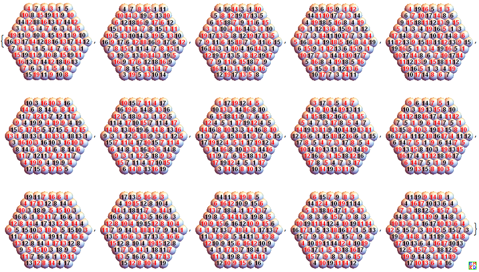  
