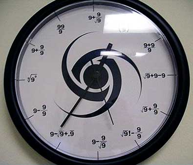

2008年3月[无心人提出挑战](https://bbs.emath.ac.cn/thread-248-1-1.html):  
使用三个$\pi$，不得有其他数字,  
加减乘除运算，乘方运算，平方根运算，取整运算,  
能表示多少整数？  
<!--more-->
# 具体内容
风云剑询问是否可以无穷次开平方？mathe建议应该只能使用有限次，但是他认为应该[可以表示出任意整数](https://bbs.emath.ac.cn/forum.php?mod=redirect&goto=findpost&ptid=248&pid=1844&fromuid=20).  
无心人觉得很奇怪，还能有比$\pi^{\pi^{\pi}}$更大的结果？  
他给出了[较小整数的三层派分解方案](https://bbs.emath.ac.cn/forum.php?mod=redirect&goto=findpost&ptid=248&pid=1881&fromuid=20):  
$1=[\sqrt{\pi} + \sqrt{\pi} - \sqrt{\pi} ]$  
$2=([\sqrt{\pi}] + [\sqrt{\pi}] \times [\sqrt{\pi}]$  
$3=[\sqrt{\pi}] + [\sqrt{\pi}] + [\sqrt{\pi}]$  
$4=[ (\sqrt{\pi} \times \sqrt{\pi})^{\sqrt[4]{\pi})}]$  
$5=[\sqrt{\pi} + \sqrt{\pi} + \sqrt{\pi}]$  
$6=[\pi + \pi] \times [\sqrt{\pi}]$  
$7=[\pi + \pi] + [\sqrt{\pi}]$  
$8=[\pi + \pi + \sqrt{\pi}]$  
$9=[\pi + \pi + \pi]$  
$10 = [ \pi \times \pi + [\sqrt{\pi}] ]$  
$11 = [ \pi \times \pi + \sqrt{\pi} ]$  
$12 = [ [ \pi \times \pi ] + [\pi] ]$  
$13 = [ \pi \times \pi + \pi]$  
$14 = [ [\pi] \times (\pi + \sqrt{\pi} ) ]$  
$15 = [ \pi \times (\pi + \sqrt{\pi}) ]$  
$16 = [ \pi \times \sqrt{\pi} \times [\pi] ]$  
$17 = [ \pi \times \pi \times \sqrt{\pi} ]$  
$18 = [ \pi ] \times [ \pi + \pi ]$  
$19 = [ \pi \times ( \pi + \pi ) ]$  
$20 = [ \frac{\pi ^ {\pi} }{ \sqrt{\pi}} ]$  
$21 = [ ( \pi \times \pi ) ^ {\sqrt{\pi}} ] = [ \pi ] \times [ \pi ^ {\sqrt{\pi}} ]$  
$22 = [ \pi ^ { \frac{\pi} {\sqrt{\sqrt{\sqrt{\pi}}} }} ]$  
$23 = [ \pi \times \pi ^ {\sqrt{\pi}} ]$  
$24 = [ ((\sqrt{\pi} ^ \pi ) ^ {\sqrt{\pi}} ]$  
$25 = [ ( \pi + \pi ) ^ {\sqrt{\pi}} ]$  
$26 = [ \pi ^ { \sqrt{\pi} + \sqrt{\sqrt{\sqrt{\sqrt{\pi}}}} } ]$  
$27 = [ \pi ] \times [ \pi ] \times [ \pi ]$  
$28 = [ [ \pi ]  \times [ \pi ] \times  \pi ] = [ [ \pi \times \pi ] \times \pi ]$  
$29 = [ [ \pi ] \times ( \pi \times \pi ) ]$  
$30 =$  
$31 = [ \pi \times \pi \times \pi ]$  
$32 = [ ( \frac{\pi }{ (\sqrt{\sqrt{\sqrt{\sqrt{\sqrt{ \pi}}}}} ) ^ {\pi}} ]$  
$33 = [ \pi ^{\pi} - \pi ]$  
$34 = [ \pi ^{\pi} - \sqrt{\pi} ]$  
$35 = [ \pi ^{\pi} ] - [ \sqrt{\pi} ]$  
$36 = [ \pi ^{\pi} \times [ \sqrt{\pi} ]]$  
$37 = [ \pi ^{\pi} ] + [ \sqrt{\pi} ]$  
$38 = [ \pi ^{\pi} + \sqrt{\pi} ]$  
$39 = [ \pi ^{\pi} + \pi ]$  
$40 = $  
$41 = [ \pi ^ { \pi \times \sqrt{\sqrt{\sqrt{\sqrt{\sqrt{\pi}}}}} } ]$  
$42 = [ \pi ^{\pi} \times \sqrt{\sqrt{\sqrt{\pi}}} ]$  
$43 = [ [ \pi ] ^ { [ \pi ] \times \sqrt{\sqrt{\sqrt{[\pi]}}} } ]$  
$44 = [ [ \pi ] ^ { [ \pi ] \times \sqrt{\sqrt{\sqrt{\pi}}} } ]$  
$45 = [ ( pi \times \sqrt{\sqrt{\sqrt{\sqrt{\pi}}}} ) ^{\pi} ]$  
$46 = [ \sqrt([ \pi ]) ^ {[ [ \pi ] ^ {\sqrt{\pi}} ]} ]$  
$47 = [ \sqrt{\pi} \times [ \pi ] ^ {[ \pi ]}  ]$  
$48 = [\sqrt{\sqrt{\pi}} \times \pi ^{\pi} ]$  
$49 = [ [ \pi ] ^ { [ \pi ] ^ {\sqrt{\sqrt{\sqrt{\pi}}}} } ]$  
$50 = [ \pi ^ { \pi ^ {\sqrt{\sqrt{\sqrt{\sqrt{\pi}}}} }}) ]$  
$51 = $  
$52 = $  
$53 = [ ( \sqrt{\pi} + \sqrt{\pi} ) ^{\pi} ]$  
$54 =$  
$55 = [ \sqrt{\pi} ^ { [ \pi ] ^ \sqrt{\pi} } ]$  
$56 =$  
$57 = [ \pi ^ { \sqrt{\pi} + \sqrt{\pi} } ]$  

[northwolves补充了](https://bbs.emath.ac.cn/forum.php?mod=redirect&goto=findpost&ptid=248&pid=1909&fromuid=20)  
$40=[\pi\sqrt{\sqrt{\sqrt{\sqrt{\sqrt{\pi}^{\pi}}}}}]$  
$30=[[\pi]^{[\pi]^{\sqrt{\sqrt{\sqrt{\sqrt{\sqrt{\pi}}}}}}}]$

[mathe表示](https://bbs.emath.ac.cn/forum.php?mod=redirect&goto=findpost&ptid=248&pid=1900&fromuid=20)，定义 sqrt(n, x)表示x连续开n次根号， 那么  
sqrt(u, pi)/(sqrt(v+d, pi)-sqrt(v,pi))  
其中d是非常小的数,v远远大于u,可以表示很大范围的数  
[然后给出](https://bbs.emath.ac.cn/forum.php?mod=redirect&goto=findpost&ptid=248&pid=1916&fromuid=20)  
找到了1到139的所有表示（不考虑计算误差）  
我们采用一种简洁的记号  
Pi表示  
前缀S表示一次开根号,Sk表示连续k次开根号  
前缀I表示一次取整，最外面还有一次取整没有标上,那么计算机搜索结果有:  
1=ISPi/(SIPi-ISPi)  
2=ISPi/(SIPi-S2IPi)  
3=ISPi/(S2IPi-ISPi)  
4=ISPi/(S2IPi-S4IPi)  
5=ISPi/(S2IPi-S3IPi)  
6=ISPi/(S3IPi-ISPi)  
7=ISPi/(S3IPi-S8Pi)  
8=ISPi/(S3IPi-S5IPi)  
9=ISPi/(S3IPi-S5Pi)  
10=S3IPi/(S3IPi-S5IPi)  
11=S2IPi/(S3IPi-S5IPi)  
12=ISPi/(S3Pi-S4IPi)  
13=ISPi/(S4Pi-ISPi)  
14=ISPi/(S4IPi-ISPi)  
15=ISPi/(S4IPi-S8Pi)  
16=ISPi/(S4IPi-S7IPi)  
17=ISPi/(S4Pi-S6IPi)  
18=ISPi/(S4IPi-S6IPi)  
19=S7IPi/(S4IPi-S6Pi)  
20=S4IPi/(S4IPi-S6Pi)  
21=S3IPi/(S4IPi-S6IPi)  
22=SIPi/(S3IPi-S4IPi)  
23=S2IPi/(S4Pi-S6IPi)  
24=ISPi/(SPi-SIPi)  
25=ISPi/(S4Pi-S5IPi)  
26=ISPi/(S4Pi-S5Pi)  
27=ISPi/(S5Pi-ISPi)  
28=ISPi/(S5IPi-ISPi)  
29=ISPi/(S5IPi-S11IPi)  
30=ISPi/(S5IPi-S9IPi)  
31=ISPi/(S5Pi-S8IPi)  
32=ISPi/(S5IPi-S8IPi)  
33=S7IPi/(S5IPi-S8Pi)  
34=S5Pi/(S5IPi-S8Pi)  
35=ISPi/(S5Pi-S7IPi)  
36=ISPi/(S5Pi-S7Pi)  
37=S6IPi/(S5Pi-S7Pi)  
38=ISPi/(S5IPi-S7IPi)  
39=S6IPi/(S5IPi-S7Pi)  
40=S4IPi/(S5IPi-S7IPi)  
41=S4IPi/(S5IPi-S7Pi)  
42=S3Pi/(S5Pi-S7Pi)  
43=S3IPi/(S5IPi-S7IPi)  
44=S3IPi/(S5IPi-S7Pi)  
45=SIPi/(S4Pi-S5Pi)  
46=SPi/(S4Pi-S5Pi)  
47=S2IPi/(S5Pi-S7IPi)  
48=S2Pi/(S5Pi-S7Pi)  
49=SIPi/(S5IPi-ISPi)  
50=S2IPi/(S5IPi-S7IPi)  
51=S2Pi/(S5IPi-S7Pi)  
52=ISPi/(S5Pi-S6IPi)  
53=S6IPi/(S5Pi-S6IPi)  
54=ISPi/(S5Pi-S6Pi)  
55=ISPi/(S6Pi-ISPi)  
56=ISPi/(S6Pi-S12IPi)  
57=ISPi/(S6IPi-ISPi)  
58=ISPi/(S6IPi-S13IPi)  
59=ISPi/(S6IPi-S11IPi)  
60=S7IPi/(S6IPi-S11IPi)  
61=ISPi/(S6IPi-S10IPi)  
62=ISPi/(S6Pi-S9IPi)  
63=ISPi/(S6Pi-S9Pi)  
64=S6IPi/(S6Pi-S9Pi)  
65=ISPi/(S6IPi-S9IPi)  
66=ISPi/(S6IPi-S9Pi)  
67=S6IPi/(S6IPi-S9IPi)  
68=S5IPi/(S6IPi-S9IPi)  
69=S2Pi/(S5Pi-S6IPi)  
70=S4IPi/(S6IPi-S9IPi)  
71=S4IPi/(S6IPi-S9Pi)  
72=ISPi/(S6Pi-S8IPi)  
73=ISPi/(S6Pi-S8Pi)  
74=S8IPi/(S6Pi-S8Pi)  
75=S6Pi/(S6Pi-S8Pi)  
76=ISPi/(S6IPi-S8IPi)  
77=ISPi/(S6IPi-S8Pi)  
78=S10IPi/(S6IPi-S8Pi)  
79=S6IPi/(S6IPi-S8Pi)  
80=S5IPi/(S6IPi-S8Pi)  
81=S2IPi/(S6IPi-S10IPi)  
82=S4IPi/(S6IPi-S8IPi)  
83=S4IPi/(S6IPi-S8Pi)  
84=S3IPi/(S6Pi-S8Pi)  
85=S3Pi/(S6Pi-S8Pi)  
86=S2IPi/(S6IPi-S9IPi)  
87=S2IPi/(S6IPi-S9Pi)  
88=S3IPi/(S6IPi-S8IPi)  
89=S3IPi/(S6IPi-S8Pi)  
90=SIPi/(S5Pi-S6IPi)  
91=IPi/(S5IPi-S9IPi)  
92=SPi/(S5Pi-S6IPi)  
93=IPi/(S5Pi-S8IPi)  
94=SIPi/(S5Pi-S6Pi)  
95=S2IPi/(S6Pi-S8IPi)  
96=S2Pi/(S6Pi-S8IPi)  
97=S2IPi/(S6Pi-S8Pi)  
98=S2Pi/(S6Pi-S8Pi)  
99=SIPi/(S6Pi-S11Pi)  
100=SIPi/(S6IPi-ISPi)  
101=S2IPi/(S6IPi-S8IPi)  
102=S2IPi/(S6IPi-S8Pi)  
103=S2Pi/(S6IPi-S8Pi)  
104=SPi/(S6IPi-S12Pi)  
105=SPi/(S6IPi-S11IPi)  
106=ISPi/(S6Pi-S7IPi)  
107=S7Pi/(S6Pi-S7IPi)  
108=SIPi/(S6Pi-S9IPi)  
109=S5IPi/(S6Pi-S7IPi)  
110=ISPi/(S6Pi-S7Pi)  
111=ISPi/(S7Pi-ISPi)  
112=ISPi/(S7Pi-S14IPi)  
113=ISPi/(S7Pi-S13IPi)  
114=ISPi/(S7Pi-S12IPi)  
115=ISPi/(S6IPi-S7IPi)  
116=ISPi/(S7IPi-ISPi)  
117=ISPi/(S7IPi-S13IPi)  
118=ISPi/(S7Pi-S11IPi)  
119=ISPi/(S7IPi-S12IPi)  
120=ISPi/(S6IPi-S7Pi)  
121=S7IPi/(S6IPi-S7Pi)  
122=S6IPi/(S6IPi-S7Pi)  
123=ISPi/(S7IPi-S11IPi)  
124=ISPi/(S7IPi-S11Pi)  
125=S7IPi/(S7IPi-S11Pi)  
126=ISPi/(S7Pi-S10IPi)  
127=ISPi/(S7Pi-S10Pi)  
128=S7IPi/(S7Pi-S10Pi)  
129=S6IPi/(S7Pi-S10Pi)  
130=S5IPi/(S7Pi-S10IPi)  
131=S5IPi/(S7Pi-S10Pi)  
132=ISPi/(S7IPi-S10IPi)  
133=ISPi/(S7IPi-S10Pi)  
134=S7IPi/(S7IPi-S10Pi)  
135=S6IPi/(S7IPi-S10Pi)  
136=S4IPi/(S7Pi-S10Pi)  
137=S5IPi/(S7IPi-S10IPi)  
138=S5Pi/(S7IPi-S10Pi)  
139=S2IPi/(S6Pi-S7IPi)  
141=S4IPi/(S7IPi-S10IPi)  
搜索了很大范围，都不能找到140，144，190这三个数（在较小范围前面的数都能够找到）  
看来140的确是不能用这种方法表示的了。  
而我前面所谓稠密判断也肯定有问题了。  
但是当然这个并不说明140不能表示出来，只要我们找到更加大的整数140^2到141^2之间的数，开平方后还是能够表示出来的。  
比如  
19625=S2IPi/(S13IPi-S14IPi)  
再次开平方取整可以得到140  
20870=S5IPi/(S14IPi-S16Pi)  
再次开平方取整可以得到144  
36211=S2IPi/(S14Pi-S15IPi)  
再次开平方取整可以得到190  
所以通过这种方法至少200以内都已经可以表示了。  
后面mathe表示他还用[计算机搜索](https://bbs.emath.ac.cn/forum.php?mod=redirect&goto=findpost&ptid=248&pid=1951&fromuid=20)到1到300万以内范围的结果,只是给出的附件已经无法下载了。  
[gxqcn表示](https://bbs.emath.ac.cn/forum.php?mod=redirect&goto=findpost&ptid=248&pid=2096&fromuid=20)，如果还允许对数、阶乘、取负运算，三个$\pi$可以表示任意正整数：  
　　$n = -\log_{[\sqrt{[\pi]!}]}{\log_{\pi}{\sqrt{\sqrt{...\sqrt{\pi}}}}}$（n 重根号）  
因为，$[\\sqrt{[\pi]!}] = [\sqrt{3!}] = [\sqrt6] = 2$  
$\log_{\pi}{\sqrt{\sqrt{...sqrt{\pi}}}}$（n 重根号）  
$\quad = \log_{\pi}{\pi^{2^{-n}}} = 2^{-n}$  

gxqcn还给出了一个用[3个9表示所有数字的钟](https://bbs.emath.ac.cn/thread-324-1-1.html).  
  
只是里面的数字1不清楚，qxqcn认为可以使用$(\frac99)^9$.  
