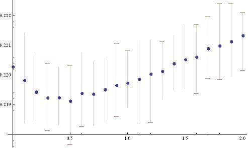
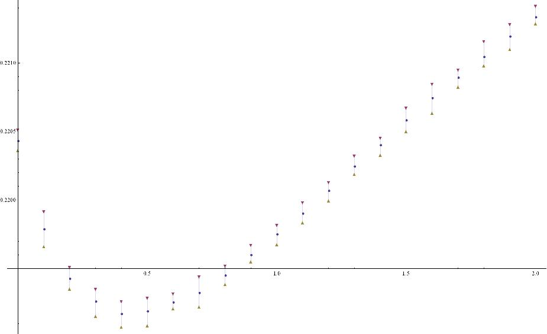
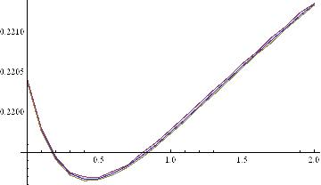
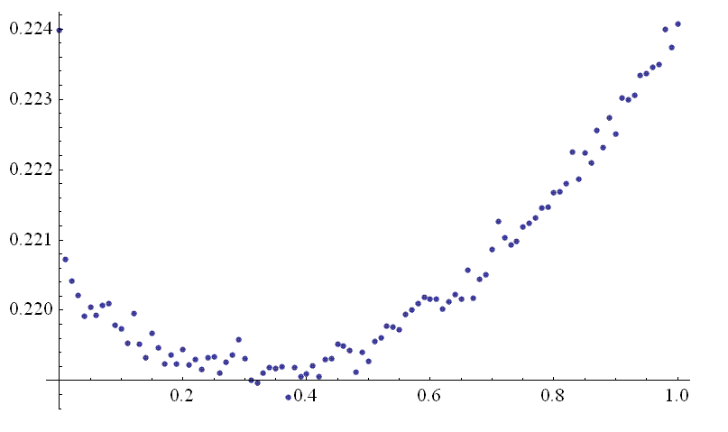
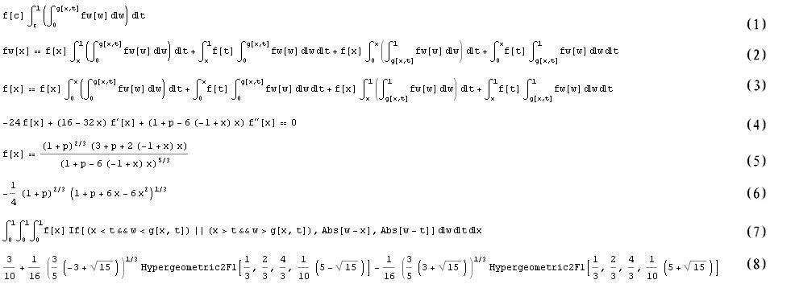
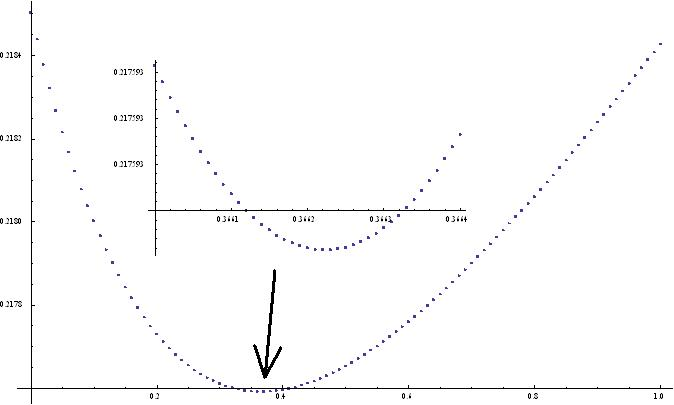

# 问题提出
2013年2月KeyTo9\_Fans提出了[wayne吃豆子问题](https://bbs.emath.ac.cn/thread-4895-1-3.html):  
假设有一条长度为$1$的线段，左端点是$x=0$，右端点是$x=1$。  
线段上有$k$个豆子，wayne在这条线段上移动。  
下图是一个$k=1$的例子:  
  
一旦wayne的$x$坐标与某个豆子的$x$坐标相等，wayne就会把这个豆子吃掉。  
一旦wayne把一个豆子吃掉，一个新的豆子就会立即出现在$[0,1]$区间中均匀分布的一个随机的点上。  
wayne的移动速度是每秒$1$单位长度。  
wayne可以随时改变移动方向。  
wayne总是采取最佳策略，使得吃豆子的平均速率最大。  
于是当$k=0$时，wayne吃豆子的平均速率是$0$个每秒；  
当$k=1$时，wayne吃豆子的平均速率是$3$个每秒。  
问题$1$：当$k=2$时，wayne吃豆子的平均速率是多少？  
问题$2$：当$k=3$时，wayne吃豆子的平均速率是多少？  
问题$3$：当$k=4$时，wayne吃豆子的平均速率是多少？:lol  

# 初步展开
wayne[认为](https://bbs.emath.ac.cn/forum.php?mod=redirect&goto=findpost&ptid=4895&pid=47761&fromuid=20):  
问题转化为求 $\sum_{i=1}^{k}|x_i -x_{i+1}|$的期望值， $x_i$在$[0,1]$内均匀分布, 并且猜测答案为$\frac3k$.  
KeyTo9\_Fans[指出](https://bbs.emath.ac.cn/forum.php?mod=redirect&goto=findpost&ptid=4895&pid=47763&fromuid=20), 问题没有这么简单:  
$k=1$当然没问题咯，豆子在哪边wayne就往哪边跑。  
可是当$k\gt 1$时就没那么简单了，  
wayne经常要思考“到底先吃哪边的豆子才能使得吃豆子的平均速率最大呢？”  
如下图所示：  
  
如果wayne总是吃最近的那个豆子，  
那么当$k=2$时，模拟到$10^{11}$个豆子，结果是……  
wayne吃豆子的平均速率是$(4.53704\pm 0.00002)$个每秒。  
可是wayne绝顶聪明，不一定总是吃最近的那个豆子，  
所以当$k=2$时，wayne吃豆子的平均速率要大于$4.53702$个每秒。  
具体大多少，就得知道wayne采取的最佳策略是什么了*_*

并且Fans继续解释进一步题目中要求：  
任何时候都有$k$个豆子存在。  
这是因为：  
“一旦wayne把一个豆子吃掉，一个新的豆子就会立即出现在$[0,1]$区间中均匀分布的一个随机的点上。”  
wayne最初的位置在哪里都不要紧。  
这是因为wayne永远都在这条线段上移动。  
当给定时间$t$时，wayne吃豆子的平均速率是$\frac{n(t)}t$，  
其中$n(t)$是wayne在$t$时间内所吃的豆子数。  
所以无论wayne最初的位置在哪里，  
$\lim_{t\to\infty}\frac{n(t)}t$的值都是一样的.  

并且[着重描述$k=2$时的情况](https://bbs.emath.ac.cn/forum.php?mod=redirect&goto=findpost&ptid=4895&pid=47776&fromuid=20)：  
当$k=2$时，wayne的策略可以用一个$3$元的布尔函数$f$来描述。  
$f$的输入是$x_1$，$x_2$，$x_w$。  
其中，$x_1$和$x_2$表示豆子的位置，$x_w$表示wayne的位置。  
$f$的输出是一个方向，“左”或者“右”。  
函数$f$确定之后，wayne的策略也就确定了。  
于是我们就可以对wayne的策略进行评价了。  
评价的方法如下：  
取一个足够大的$t$，然后任取一个开始状态，  
然后把wayne和豆子的位置作为函数$f$的输入，  
根据$f$的输出来决定wayne下一步吃哪个豆子。  
我们用$n(t)$来表示wayne在$t$时间内所吃的豆子数。  
$\frac{n(t)}t$越大，说明wayne的策略越好，$\frac{n(t)}t$越小，说明wayne的策略越差。  
如果我们对所有可能的函数$f$都模拟过一遍，我们就知道wayne的最佳策略是什么了。  

# 最近策略不必然最优
KeyTo9\_Fans通过实验的方法发现，当$k=2$时，“总是吃最近的豆子”[并不是最佳策略](https://bbs.emath.ac.cn/forum.php?mod=redirect&goto=findpost&ptid=4895&pid=47782&fromuid=20)。  
当两个豆子差不多近时，优先吃边上的豆子，可以吃得更快:lol  
  
具体的策略函数如下：  
如果Score $(x_1)\gt $ Score $(x_2)$，那么$f(x_1,x_2,x_w)=Go(x_w\to x_1)$，否则$f(x_1,x_2,x_w)=Go(x_w\to x_2)$。  
其中：  
$Score(x_i)=\frac{|x_i-\frac12|+\frac12}{|x_w-x_i|}$，（表示豆子离$\frac12$处越远越好，离wayne越近越好）  
$Go(x_w\to x_i)$表示$x_i$在$x_w$的哪边就去哪边。  
该策略吃豆子的平均速率是$(4.55648\pm0.00001)$个每秒，比“总是吃最近的豆子”的策略好。  
（$3$楼“总是吃最近的豆子”的策略的速率只有$(4.53704\pm0.00002)$个每秒）
wayne建议Score函数里面的参数$\frac12$可以替换成其它值再试验一下看看。  
Fans经过试验，[得出](https://bbs.emath.ac.cn/forum.php?mod=redirect&goto=findpost&ptid=4895&pid=47932&fromuid=20):  
最佳权重$p=0.45\pm 0.02$，吃$1$个豆的期望时长是$0.219157\pm 0.000002$  

# 不同权函数试验
mathe[认为](https://bbs.emath.ac.cn/forum.php?mod=redirect&goto=findpost&ptid=4895&pid=47798&fromuid=20):  
其实k=2时，本质是求一个函数$g(x_1,x_2)$,如果$x_w\lt g(x_1,x_2)$那么选择左边，如果$x_w\gt g(x_1,x_2)$选择右边。同样k=n时是求一个将n个数映射到n-1个数的函数。  
而给定选择函数，应该可以通过迭代得出$(x_1,x_2,...,x_k,x_w)$的一个稳定的分布密度，也就是经过一次迭代后密度函数保持不变。然后计算这个密度函数下的平均速率，所以是一个带额外约束条件变分问题，只是k越大，表达式越复杂，很难计算。

zgg\_\_[参考mathe的思路](https://bbs.emath.ac.cn/forum.php?mod=redirect&goto=findpost&ptid=4895&pid=47804&fromuid=20)，尝试了一些函数g，最后还是选择了平均数，令gq(x1,x2)为x1、x2和$\frac12$这三个数的加权算数平均数，其权的比例为1：1：q，故$gq(x1,x2)=\frac{x1+x2+\frac q2}{q+2}$。然后做了一点数据模拟，对每一个k，每次吃$10^5$个豆，反复吃50次求平均、最大和最小（代码见下）。
```bash
g[x1_, x2_, k_] := (x1 + x2 + k/2)/(k + 2);
ks = {};
Do[ts = {};
  Do[w = 0.5; t = 0; s1 = Random[]; s2 = Random[];
   Do[If[s1 < s2, x1 = s1; x2 = s2, x1 = s2; x2 = s1;];
    If[w < g[x1, x2, k], tt = Abs[w - x1]; w = x1; s1 = x2;, 
     tt = Abs[w - x2]; w = x2; s1 = x1;];
    s2 = Random[]; t = (t n + tt)/(n + 1);, {n, 0, 100000}];
   AppendTo[ts, t];, {50}];
  AppendTo[ks, {{k, Mean[ts]}, {k, Min[ts]}, {k, Max[ts]}}]; 
  Print[k];, {k, 0, 2, 0.1}];
ListPlot[Transpose[ks], Filling -> {1 -> {2}, 1 -> {3}}, 
 PlotMarkers -> {" \[FilledCircle]", "\[LongDash]", "\[LongDash]"}]
 ```
 结果如图，纵轴是吃每一个豆的平均时长，是lz说的吃豆速度的倒数，横轴是1/2的权重，当权重q=0，相当于吃最近的，当权重q很大时，相当于随便吃，即每次出现一个豆的情况(k=1)。此代码效率低，有空弄个好点的。
  
然后又计算了$10^7$颗豆子吃10次，[得到](https://bbs.emath.ac.cn/forum.php?mod=redirect&goto=findpost&ptid=4895&pid=47826&fromuid=20)
  
然后用[写了段C代码](../attached/bean/zgg.txt)并且[将结果用Mathematica作图](https://bbs.emath.ac.cn/forum.php?mod=redirect&goto=findpost&ptid=4895&pid=47828&fromuid=20)得到下图:  
  

dianyancao也给出了[他的一种策略](https://bbs.emath.ac.cn/forum.php?mod=redirect&goto=findpost&ptid=4895&pid=48297&fromuid=20):  
使用如下策略得到的结果  
p=0.38  
t=0.218766  
v1 = Abs[w - rightx] + p * Abs[leftx - xforecast];  
v2 = Abs[w - leftx] + p * Abs[rightx - xforecast];  

rightx位于w右边，leftx位于w左边，xforecast=1/2
根据v1和v2的大小关系，确定吃右边的豆子还是左边的豆子
已经对应的[Mathematica代码](../attached/bean/dianyancao.txt)和结果图:
  

# 更多豆子的思考
[无心人提议](https://bbs.emath.ac.cn/forum.php?mod=redirect&goto=findpost&ptid=4895&pid=47878&fromuid=20):  
假设当前处在位置$x$，豆子在两边各有$y_1$, $y_2$个，相对密度分别是$\frac{y_1}x$, $\frac{y_2}{1-x}$  
当前位置分割区间为2部分，相对有2个可选择移动方向  
假设当前吃完一个豆子，下个豆子出现的时候总是早于wayne的思考的开始  
假设wayne思考时间为0，  
假设初始wayne处于0.5位置，且假设初始豆子先于wayne出现

策略1：总向当前豆子数最多的方向移动，如果相等，则向距离边界最短的方向移动，如果距离两边界也相等，则向密度最大方向移动，如果连密度都相等，则保持当前移动方向不变。。。  
策略2：总向当前豆子密度最大的方向移动，如果密度相等，则向距离边界最短的方向移动，如果距离两边界也相等，则豆子最多方向移动，如果连豆子数都相等，则保持当前移动方向不变。  
策略3：先右，或者先左，直到某方向没有豆子再转向，转向之后，即使身后出现新豆子也不回退  
策略4：先右直到边界再转向，或者先左直到边界再转向  
策略5：先吃左边然后马上转向右边，或者先吃右边然后马上转向左边  

# 采用积分计算
mathe[提议](https://bbs.emath.ac.cn/forum.php?mod=redirect&goto=findpost&ptid=4895&pid=47971&fromuid=20)，k=2时设最优策略是g(a,b),也就是在豆子位置为$x_1\lt x_2$，如果$w<g(x_1,x_2)$,选择$x_1$位置的豆子，不然另外一个豆子。那么设稳定时豆子和wayne位置的密度分布函数为$p(x_1,x_2,w)$  
记$K(a,b)=\int_0^{g(a,b)} p(a,b,w)dw, F(a,b)=\int_{g(a,b)}^1 p(a,b,w)dw$  
对于$w\lt a\lt b$,必然有$p(a,b,w)=K(w,b)+F(w,a)$,同样计算$a\lt w\lt b$和$a\lt b\lt w$情况都是两个函数和的形式。  
然后再次代入K,F的定义得出它们的积分表达式，这样就可以变成一个两个变量的积分等式问题，如果用计算机计算，就可以比原问题少一个维数，从而大大降低计算量  
zgg继续结合他的权函数，采用[积分算式计算](https://bbs.emath.ac.cn/forum.php?mod=redirect&goto=findpost&ptid=4895&pid=48070&fromuid=20):  
对k=2时情况的计算有了一点进展，呵呵。
假定函数fw是w吃完豆后的分布，f是w没吃的那个豆的分布，ft是新出的豆的分布（题目中ft=1），g是判据。当w刚吃完后，用w表示他的位置，用t表示剩下豆的位置，用x表示新出豆的位置，那么fw(c)是怎样的呢？w吃完豆后要落在c点，有两种可能性，一种是x恰好落在c并且w的位置满足吃x的条件，另一种是t恰好落在c并且w的位置满足吃t的条件。对于第一种可能，又有两种情况，一是x<t且w<g(x,t,p)，另一是x>t且w>g(x,t,p)。对于第一种情况，有图中式1，剩下的三种同理，并且用字母x替换字母c，有图中式2，再同理可以计算f，有图中式3。把2式和3式相加，就可以得到fw=1了。
将fw=1代入2式，并且对x求2次导数，就可以得到微分方程了，如果限定g[x,t]=(x+t+p/2)/(p+2)，那么方程为图中式4（用3式也是一样的）。这个方程是可解的，可以得到式5的结果（注：5式恰好是6式的二阶导数）。然后将5式f的结果代入7式就可以求出预期的吃豆时长了。7式只是依赖于p，当p为特殊值时是有符号解的，例如p=0时（w总去吃最近的豆），得到8式(0.218501)的结果，对7式进行数值计算，可以得到如下图的结果。呵呵。
  
  
但是给出的结果好像有点问题，结果有点太好了。  
mathe对最简单的权函数$g(a,b)=\frac{a+b}2$进行积分运算，分别给出了两个不同版本的Pari/gp代码: [代码1](../attached/bean/zdu1.txt)， [代码2](../attached/bean/zdu2.txt).  
[最后得出](https://bbs.emath.ac.cn/forum.php?mod=redirect&goto=findpost&ptid=4895&pid=48128&fromuid=20):  
```bash
(16:06) gp > getdist(2)
%17 = 0.2114583333333333333333333333
(16:07) gp > getdist(10)
%18 = 0.2203686807254583318975768873
(16:07) gp > getdist(20)
%19 = 0.2204074196271448826430741941
(16:07) gp > getdist(30)
%20 = 0.2204077318388700882261725891
(16:07) gp > getdist(40)
%21 = 0.2204077356077135199957228968
(16:07) gp > getdist(50)
%22 = 0.2204077356585942289207798388
(16:07) gp > getdist(60)
%23 = 0.2204077356593274980124179385
(16:07) gp > getdist(70)
%25 = 0.2204077356593385397246878697
(16:33) gp > getdist(99)
%1 = 0.2204077356593387142224517526
(16:10) gp > getdist(100)
%26 = 0.2204077356593387141426361209
```
也就是我们可以得出$g(a,b)=\frac{a+b}2$时的高精度结果，也就是每秒4.537次,同Fans的模拟结果匹配.  

# k=2时结果总结
KeyTo9\_Fans[对多种策略进行模拟比较](https://bbs.emath.ac.cn/forum.php?mod=redirect&goto=findpost&ptid=4895&pid=48340&fromuid=20):  
比较结果如下：

|策略|结果|
|----|----|
|$g(x_1,x_2)=\frac{x_1+x_2}2$|$t=0.220408(1)$|
|$Score(x)=\frac{\mid x-\frac12\mid+a}{\mid w-x\mid}|$a=0.523(5),t=0.2194662(5)$|
|$Score(x)=\mid w-x^{\prime}\mid +p\mid x-\frac12\mid $| $p=0.311(5),t=0.2191733(5)$|
|$g(x_1,x_2)=\frac{x_1+x_2+\frac p2}{2+p}$|$p=0.478(5),t=0.2191031(5)$|
|$g(x_1,x_2)=\frac{\max\{x_1,x_2\}}{1+\mid x_1-x_2\mid}$|$t=0.2190061(5)$|
|$g(x_1,x_2)=\frac{x_1+x_2+\frac p2\mid x_1-x_2\mid}{2+p\mid x_1-x_2\mid }$|$p=1.753(5),t=0.2189915(5)$|
|$g(x_1,x_2)=\frac{x_1+x_2+\frac p2\mid x_1-x_2\mid ^q}{2+p\mid x_1-x_2\mid ^q}$|$p=1.28(3),q=0.72(2),t=0.2189685(5)$|
|传说中的最佳策略|$t=0.21889630(1)$|

通过某种神奇的方法，  
我终于得到了最佳策略下的平均吃豆时长，  
为$0.21889630(1)$，  
但该策略具体是什么还不知道。  
我将该结果列在了上表的最后一行，  
可以看到目前已知的最好的策略的平均吃豆时长已经与最佳策略的平均吃豆时长很接近了。  

于是，楼主的第$1$问终于有一个近似的答案了：  
当$k=2$时，wayne吃豆子的平均速率是$4.5683732(2)$个每秒。  

为了展示吃$2$个豆子的最佳策略,  
Fans把这个问题做成了[一个游戏](../attached/bean/best_collect.rar)。  
解压上面附件后运行“best_collect.exe”，就可以看到【传说中的最佳策略】了。
注意：  
要把“solution.txt”和“best_collect.exe”放在同一个文件夹里，不要分开了。  
#####
美中不足的是，我们只有【传说中的最佳策略】的一些离散的数据。  
能否根据这些离散的数据找到函数$g(x_1,x_2)$的解析式呢？  
